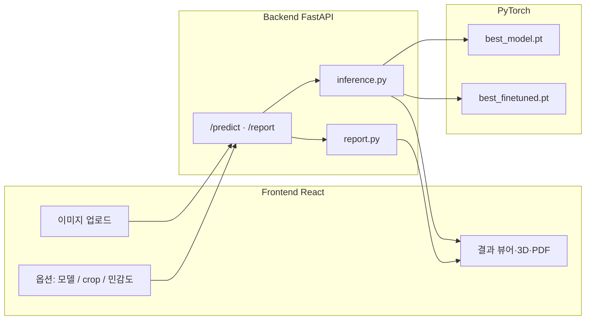

# ArtiFix

**유물·문화재 이미지의 표면 손상을 자동으로 탐지·분류하고, 웹 UI로 시각화하는 컴퓨터 비전 시스템입니다.**

박물관·문화재 보존 현장에서 전문가가 육안으로 수행하던 손상 기록·모니터링을 딥러닝으로 보조합니다.  
**복원(Restoration)이나 3D 재구성(Reconstruction)을 목표로 하지 않으며**, 손상 위치·유형·심각도를 **기록·검토**하는 데 초점을 둡니다.

---

## 목차

- [프로젝트 개요](#프로젝트-개요)
- [주요 기능](#주요-기능)
- [시스템 아키텍처](#시스템-아키텍처)
- [모델](#모델)
- [추론 파이프라인](#추론-파이프라인)
- [프로젝트 구조](#프로젝트-구조)
- [실행 방법](#실행-방법)
- [API](#api)
- [프론트엔드 UI](#프론트엔드-ui)
- [환경 변수](#환경-변수)
- [데이터·가중치](#데이터가중치)
- [기술 스택](#기술-스택)
- [제한 사항](#제한-사항)
- [로드맵](#로드맵)

---

## 프로젝트 개요

| 항목 | 설명 |
|------|------|
| **입력** | 유물 사진 (JPG / PNG) |
| **출력** | 손상 마스크, 오버레이, Grad-CAM, 다중 라벨 분류 점수, 심각도, PDF 보고서 |
| **손상 유형** | `crack`(균열), `surface_damage`(표면 손상·박락), `discoloration`(변색) |
| **구성** | FastAPI 백엔드 + React(Vite) 프론트엔드 |

학습은 **EfficientNet-B2 + U-Net** 멀티태스크 구조로 진행했으며, 추론 시 **RGB + Sobel Edge(4채널)** 입력을 사용합니다.

---

## 주요 기능

### 1. 손상 Segmentation
- 픽셀 단위 이진 손상 마스크 생성
- 크롭된 유물 이미지 위에 **빨간색 오버레이** 합성
- `seg_threshold`(기본 0.10, 범위 0.05~0.30)로 민감도 조절 가능

### 2. Multi-label Classification
- 이미지 전체에 대해 3종 손상 유형별 **신뢰도(0~1)** 반환
- UI에는 유형별 **퍼센트**만 표시 (임계값 기반 감지/미감지 배지 없음)

### 3. 유물 영역 자동 Crop
- **`rembg`(기본)**: AI 배경 제거 → 아이보리 배경 합성 → 유물 실루엣 기준 crop  
- **`legacy`**: HSV·Otsu·엣지 기반 기존 crop 파이프라인  
- crop 면적이 너무 작으면(`< 35%`) 원본 프레임 유지

### 4. 후처리·품질 보정
- 배경·외곽 오탐 제거 (`damage_allowed` 마스크)
- Morphology close, 내부 hole(결손) 검출·제한
- 연결 요소 기반 **바운딩 박스** 목록 (`bboxes`)

### 5. Grad-CAM
- 분류 헤드 기준 **주의 영역 히트맵** 시각화

### 6. PDF 보고서
- 크롭 이미지, 마스크, 오버레이, Grad-CAM, 라벨·심각도 요약 (한글 폰트: `NanumGothic.ttf`)

### 7. 3D Damage Preview
- 배경 제거된 **`artifact_overlay_image`** 텍스처를 Sphere / Cylinder / **얇은 판(Box)** 에 투영
- **평면** 모드: segmentation mask를 **displacement map**으로 사용해 손상 위치를 **미세 입체 강조** (강도 약 0.055, 복원 목적 아님)
- Three.js + OrbitControls

### 8. 모델 선택
| `model_variant` | 가중치 파일 | 설명 |
|-----------------|-------------|------|
| `base` | `best_model.pt` | 파인튜닝 전 |
| `finetuned` | `best_finetuned.pt` | 파인튜닝 후 (기본값) |

---

## 시스템 아키텍처



---

## 모델

### 구조 (`ArtiFix` in `backend/inference.py`)

```
RGB (3) + Sobel Edge (1)  →  4채널, 256×256
        ↓
EfficientNet-B2 (encoder, segmentation-models-pytorch)
        ↓
U-Net Decoder  →  Segmentation (1채널 logit)
        ↓
Bottleneck  →  Classification Head  →  3-class multi-label
```

- **Segmentation**: `smp.Unet`, `encoder_name='efficientnet-b2'`
- **Classification**: Global Average Pooling + Linear(128) + Dropout + Linear(3)
- **추론 해상도**: 256×256 → 원본 crop 해상도로 마스크 업샘플

### 손상 유형 (`CLASS_NAMES`)

| ID | 한글(UI) | 설명 |
|----|----------|------|
| `crack` | Crack | 균열·미세 균열 |
| `surface_damage` | Surface Damage | 표면 박락·손상 |
| `discoloration` | Discoloration | 변색·얼룩 |

### 심각도 (`severity`)

`damage_ratio`(손상 픽셀 비율)와 분류 감지 개수를 조합해 `high` / `medium` / `low` / `none` 등급을 산출합니다.

---

## 추론 파이프라인

1. **디코딩** — 업로드 BGR 이미지
2. **Preprocess**
   - `use_auto_crop=true` 시 `crop_mode`에 따라 rembg 또는 legacy crop
   - rembg: 전경 마스크 → 아이보리 배경 RGBA 합성 → tight bbox crop
3. **모델 추론** — 4채널 텐서, seg sigmoid + cls sigmoid
4. **Postprocess**
   - `damage_allowed`로 유물 외부·배경 손상 제거
   - morphology, hole 필터, 외곽 컴포넌트 제거
5. **산출물**
   - `cropped`, `mask`, `overlay`, `gradcam`
   - `artifact_image`(투명 PNG, 유물만), `artifact_overlay_image`(유물+손상 오버레이)
   - `labels`, `bboxes`, `damage_ratio`, `severity`

---

## 프로젝트 구조

```
ArtiFix/
├── backend/
│   ├── main.py              # FastAPI 엔트리, CORS, /predict, /report, /health
│   ├── inference.py         # 모델 정의, crop, predict, RGBA 아티팩트 이미지
│   ├── report.py            # PDF 보고서 생성
│   ├── requirements.txt
│   ├── NanumGothic.ttf      # PDF 한글 폰트
│   └── weights/             # *.pt (Git 미포함, 로컬 배치 필요)
│       ├── best_model.pt
│       └── best_finetuned.pt
├── frontend/
│   ├── src/
│   │   ├── api/api.js       # predict, report, mock API
│   │   ├── pages/           # Home, About
│   │   └── components/      # 업로드, 결과, 3D, Grad-CAM, 슬라이더 등
│   ├── package.json
│   └── vite.config.js
├── real_dataset/            # 실사진·마스크 (학습/평가용, 선택)
├── model/                   # 학습 스크립트·노트북 등 (있을 경우)
├── image/                   # 샘플 이미지
└── README.md
```

---

## 실행 방법

### 사전 요구 사항

- **Python** 3.10+ (3.11~3.13 테스트 환경)
- **Node.js** 18+ (프론트)
- **CUDA** (선택, 없으면 CPU 추론)
- 학습된 가중치: `backend/weights/best_model.pt`, `best_finetuned.pt`

### 1. 백엔드

```bash
cd backend
python -m venv venv

# Windows
venv\Scripts\activate

# macOS / Linux
source venv/bin/activate

pip install -r requirements.txt
```

> **rembg** 첫 실행 시 `u2net.onnx` 등 ONNX 모델을 다운로드합니다.  
> `pip install "rembg[cpu]"`가 `requirements.txt`에 포함되어 있습니다.  
> 서버가 크래시하면 브라우저에서 CORS 오류처럼 보일 수 있으므로, 터미널 로그를 확인하세요.

```bash
# backend 디렉터리에서
uvicorn main:app --reload --port 8000
```

- 헬스 체크: http://localhost:8000/health  
- API 문서: http://localhost:8000/docs

### 2. 프론트엔드

```bash
cd frontend
npm install
npm run dev
```

- 기본 주소: http://localhost:5173  
- 백엔드 연동 시 `frontend/.env` (또는 `.env.local`):

```env
VITE_API_BASE_URL=http://localhost:8000
VITE_USE_MOCK_API=false
```

Mock API만 쓰려면 `VITE_USE_MOCK_API=true`로 설정하면 백엔드 없이 UI를 확인할 수 있습니다.

### 3. 프로덕션 빌드 (프론트)

```bash
cd frontend
npm run build
npm run preview   # http://localhost:4173
```

`main.py` CORS에 `4173` 포트가 허용되어 있습니다.

---

## API

### `GET /health`

서버·로드된 모델·기본 crop 모드 확인.

```json
{
  "status": "ok",
  "models": ["base", "finetuned"],
  "default_model_variant": "finetuned",
  "crop_modes": ["rembg", "legacy"],
  "default_crop_mode": "rembg"
}
```

### `POST /predict`

**Content-Type:** `multipart/form-data`

| 필드 | 타입 | 기본값 | 설명 |
|------|------|--------|------|
| `image` | file | (필수) | JPG / PNG |
| `seg_threshold` | float | `0.10` | Segmentation 민감도 (0.05~0.30으로 클램프) |
| `use_auto_crop` | string | `true` | 자동 crop 사용 여부 |
| `model_variant` | string | `finetuned` | `base` \| `finetuned` |
| `crop_mode` | string | `rembg` | `rembg` \| `legacy` |

**응답 (주요 필드)**

| 필드 | 설명 |
|------|------|
| `original_image` | crop된 RGB (base64 PNG) |
| `artifact_image` | 배경 제거 유물 RGBA (base64 PNG) |
| `artifact_overlay_image` | 유물 + 손상 오버레이 RGBA |
| `mask_image` | 손상 마스크 시각화 |
| `overlay_image` | 손상 오버레이 |
| `gradcam_image` | Grad-CAM |
| `labels` | `{ crack, surface_damage, discoloration }` 신뢰도 |
| `damage_ratio` | 손상 픽셀 비율 (%) |
| `severity` | 심각도 등급 |
| `bboxes` | `[{ x, y, w, h, area }, ...]` |
| `model_variant` | 사용된 모델 ID |

### `POST /report`

`/predict`와 동일한 form 필드(민감도 제외 가능)로 분석 후 **PDF 바이너리** 반환.

---

## 프론트엔드 UI

| 화면 / 컴포넌트 | 역할 |
|-----------------|------|
| **Home** | 업로드, 분석 옵션, 결과 표시 |
| **UploadOptions** | 모델 variant, Crop Mode, Auto Crop |
| **AnalysisControls** | Segmentation 민감도 슬라이더 (변경 시 재분석) |
| **ResultViewer** | 탭: 인터랙티브 분석 / Grad-CAM / 전후 비교 / 전체 보기 |
| **InteractiveCanvas** | bbox 클릭·오버레이 강도 |
| **ThreeDPreviewModal** | 3D Damage Preview (Sphere / Cylinder / 평면) |
| **ReportDownloadButton** | PDF 다운로드 |
| **About** | 모델 구조·기술 스택 소개 |

각 옵션 옆 **(i)** 툴팁은 `featureHelp.js`에 정의된 설명을 표시합니다.

---

## 환경 변수

### 프론트 (`frontend/.env`)

| 변수 | 기본값 | 설명 |
|------|--------|------|
| `VITE_API_BASE_URL` | `http://localhost:8000` | 백엔드 URL |
| `VITE_USE_MOCK_API` | `false` | `true`면 더미 응답 |

### 백엔드

별도 `.env` 없이 `main.py` / `inference.py` 상수로 동작합니다.  
GPU 사용 시 PyTorch가 CUDA를 자동 감지합니다 (`DEVICE` in `inference.py`).

---

## 데이터·가중치

- **가중치**: `backend/weights/*.pt`는 `.gitignore`에 포함됩니다 (GitHub 100MB 제한).  
  저장소 클론 후 가중치를 해당 경로에 직접 배치해야 합니다.
- **`real_dataset/`**: 실제 촬영 이미지·마스크 (로컬 학습·평가용, 선택 사항)
- **합성·Crack500 등**: 학습 파이프라인은 `model/` 및 Kaggle 노트북 환경에서 수행 (프로젝트 Phase 참고)

---

## 기술 스택

| 영역 | 기술 |
|------|------|
| **딥러닝** | PyTorch, segmentation-models-pytorch, Albumentations |
| **추론·CV** | OpenCV, NumPy, rembg (ONNX Runtime) |
| **API** | FastAPI, Uvicorn |
| **리포트** | ReportLab, Pillow |
| **프론트** | React 18, Vite 6, Tailwind CSS 3, Three.js |
| **학습** | Kaggle (T4 GPU) 등 |

---

## 제한 사항

- **의료·법적 감정을 대체하지 않습니다.** 보존 전문가의 최종 판단이 필요합니다.
- 조명·배경·촬영 각도에 따라 segmentation·분류 성능이 달라질 수 있습니다.
- 3D Preview는 **손상 위치 시각적 강조**용이며, 실제 형상 복원이 아닙니다.
- rembg·대용량 이미지·첫 ONNX 다운로드 시 응답이 지연될 수 있습니다.
- 가중치 파일이 없으면 서버 시작 시 모델 로드에서 실패합니다.

---

## 로드맵

프로젝트는 대략 아래 Phase로 진행·확장되었습니다.

| Phase | 내용 | 상태 |
|-------|------|------|
| 1 | 데이터 파이프라인 (Crack500, 4채널 RGB+Sobel, augmentation) | 진행·확장 |
| 2 | EfficientNet-B2 + U-Net 멀티태스크 학습 | 완료 |
| 3 | Ablation (Seg-only, Sobel 유무, 합성 데이터) | 연구 |
| 4 | FastAPI 추론 API | **완료** |
| 5 | React 웹 UI (오버레이, Grad-CAM, PDF, 3D Preview) | **완료** |
| 6 | rembg crop, 파인튜닝 모델 선택, artifact RGBA | **완료** |

향후 가능한 개선: 실데이터(`real_dataset`) 기반 추가 파인튜닝, 배치 분석 API, 사용자 피드백 수집 등.

---

## 라이선스·문의

학술·과제용 프로젝트입니다. 가중치·데이터셋의 외부 배포 정책은 각 출처 라이선스를 따릅니다.

문제 발생 시: 백엔드 터미널 로그, `/health`, 브라우저 개발자 도구 Network 탭을 우선 확인하세요.
