<div align="center">
  
</div>

# ArtiFix

**유물·문화재 이미지의 표면 손상을 자동으로 탐지·분류하고, 웹 UI로 시각화하는 컴퓨터 비전 시스템입니다.**

박물관·문화재 보존 현장에서 전문가가 육안으로 수행하던 손상 기록·모니터링을 딥러닝으로 보조합니다.
**복원(Restoration)이나 3D 재구성(Reconstruction)을 목표로 하지 않으며**, 손상 위치·유형·심각도를 **기록·검토**하는 데 초점을 둡니다.

---

## 목차

- [프로젝트 배경](#프로젝트-배경)
- [주요 기능](#주요-기능)
- [실험 과정](#실험-과정)
- [시스템 아키텍처](#시스템-아키텍처)
- [기술 스택](#기술-스택)
- [프로젝트 구조](#프로젝트-구조)
- [실행 방법](#실행-방법)
- [API 명세](#api-명세)
- [프론트엔드 UI](#프론트엔드-ui)
- [환경 변수](#환경-변수)
- [가중치·데이터](#가중치데이터)
- [제한 사항 및 향후 과제](#제한-사항-및-향후-과제)

---

## 프로젝트 배경

문화재 손상은 균열, 박락, 변색 등 다양한 형태로 나타나며, 이를 체계적으로 기록하는 일은 보존 관리의 첫 단계입니다. 그러나 기존 방식은 전문가의 육안 검사와 수작업 기록에 의존해 시간과 비용이 많이 소요됩니다.

ArtiFix는 딥러닝 기반 Segmentation과 Multi-label Classification을 결합한 멀티태스크 모델로 이 과정을 자동화합니다. 이미지 한 장을 업로드하면 손상 위치(픽셀 마스크)·유형(3종 분류)·심각도를 즉시 산출하고, Grad-CAM과 3D 시각화·PDF 보고서까지 한 화면에서 제공합니다.

| 입력 | 출력 |
|------|------|
| 유물 사진 (JPG / PNG) | 손상 마스크, 오버레이, Grad-CAM, 다중 라벨 분류 신뢰도, 심각도 등급, PDF 보고서 |

<div align="center">
  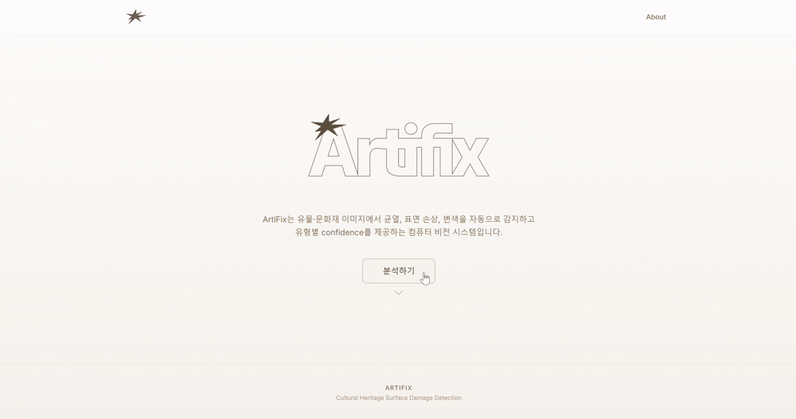
</div>

---

## 주요 기능

웹 UI는 **분석 옵션 선택 → 이미지 업로드 → 결과 확인** 순서로 동작합니다. 메인 화면에서 **「분석하기」** 를 누르면 분석을 진행할 수 있습니다.

각 옵션 옆 **(i)** 아이콘을 누르면 기능에 대한 설명이 표시됩니다.

---

### 1. 분석 옵션 선택

**「분석 옵션」** 카드에서 추론 방식을 지정합니다. **이미지를 업로드하기 전에** 옵션을 먼저 설정하는 것이 기본 흐름이며, 일부는 결과 화면에서도 조절할 수 있습니다.
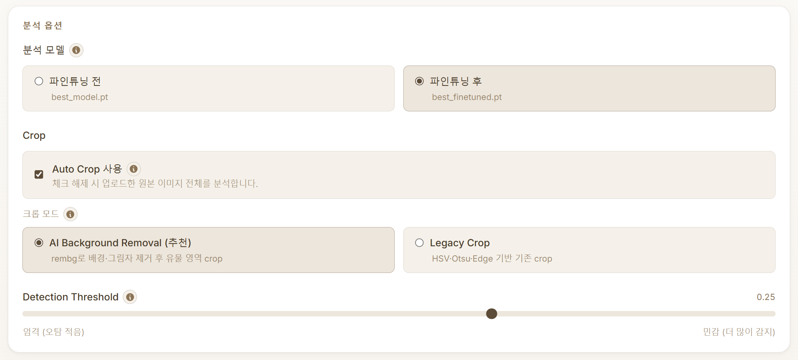
#### 분석 모델 선택

| 옵션 | 가중치 | 설명 |
|------|--------|------|
| **파인튜닝 후** (기본) | `best_finetuned.pt` | 실제 유물 데이터로 파인튜닝된 모델 |
| **파인튜닝 전** | `best_model.pt` | 파인튜닝 전 베이스 모델 |

동일 이미지에 두 모델을 각각 적용해 Segmentation·분류 품질을 비교할 수 있습니다. [3-8. 모델 비교](#3-8-모델-비교-파인튜닝-전-vs-후)에서 같은 유물에 대한 결과 차이 예시를 확인할 수 있습니다.

#### Crop 선택

| 옵션 | 설명 |
|------|------|
| **Auto Crop 사용** (기본 켜짐) | 유물 영역을 자동으로 잘라 모델 입력에 맞춥니다. 끄면 **업로드한 원본 전체**를 분석합니다. |
| **AI Background Removal** (rembg, 기본) | U²-Net 기반 배경 제거 → 아이보리 배경 합성 → 유물 bbox tight crop. 박물관 배경·그림자 제거에 유리합니다. |
| **Legacy Crop** | HSV·Otsu·엣지 기반 규칙 crop. rembg가 실패하거나 어두운 유물에 더 나을 때 선택합니다. |

crop 면적이 원본의 **35% 미만**이면 과도한 잘림으로 보고 **원본 프레임을 유지**합니다.

#### Detection Threshold 설정 

- Segmentation 마스크 생성 **임계값**입니다. **낮을수록** 더 많은 영역을 손상으로 잡고, **높을수록** 보수적으로 잡습니다.
- **업로드 전**: 분석 옵션 카드의 슬라이더로 설정 (기본 **0.25**, 서버 허용 범위 **0.05~0.60**).
- **분석 후**: **Detection Sensitivity** 슬라이더로 변경 가능하며, 슬라이더를 놓으면 **동일 이미지로 재분석**됩니다.

---

### 2. 이미지 업로드

[분석 옵션](#1-분석-옵션-선택)을 설정한 뒤, 유물 사진을 업로드하면 선택한 옵션이 그대로 적용됩니다.
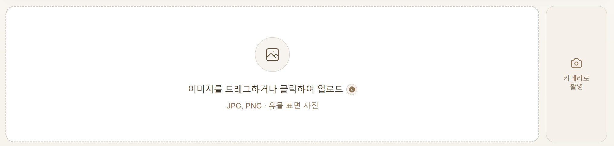
| 방식 | 설명 |
|------|------|
| **파일 업로드** | JPG·PNG를 드래그 앤 드롭하거나 클릭해 선택합니다. |
| **카메라 촬영** | 업로드 영역 옆 **「카메라로 촬영」** 버튼으로 웹캠·모바일 카메라에 접근해 현장에서 바로 촬영·분석할 수 있습니다. |

- 업로드가 완료되면 **즉시 서버 추론**이 시작되며, 처리 중에는 미리보기와 로딩 스피너가 표시됩니다.
- 지원 형식: **JPG, PNG** (유물 표면이 잘 보이도록 촬영·크롭된 이미지 권장).

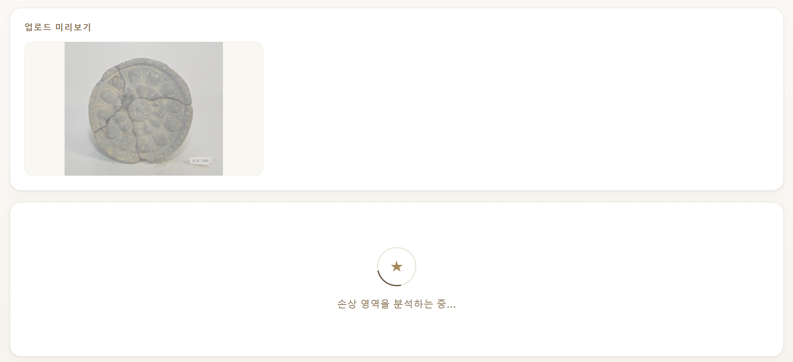
---

### 3. 결과 확인

추론이 끝나면 **「분석 결과」** 섹션에서 손상 위치·유형·심각도를 확인하고, 시각화·저장·보고서까지 이어집니다.

#### ArtiFix가 다루는 손상 유형

ArtiFix는 유물·문화재 표면에서 자주 기록되는 손상을 **세 가지 유형**으로 분류합니다. Segmentation은 **손상이 있는 위치(픽셀)** 를 하나의 마스크로 찾고, Classification은 아래 유형별로 **이미지 전체에 해당 손상이 얼마나 해당하는지** confidence(0~100%)를 독립적으로 반환합니다. 한 장에 여러 유형이 동시에 나타날 수 있어 **Multi-label** 방식을 사용합니다.

| ID (API·UI) | 표시명 | 설명 | 전형적인 예 |
|-------------|--------|------|-------------|
| `crack` | Crack (균열) | 표면에 생긴 **선형·망상 균열**, 미세 crack, 깨짐선 | 도자기·석재·기와의 헤어라인, 뻗어 나가는 균열 |
| `surface_damage` | Surface Damage (표면 손상) | 재질이 **떨어지거나 깎인 박락·깨짐**, 국소적 표면 결손 | 모서리·돌출부의 chip, flaking, 표면 벗겨짐 |
| `discoloration` | Discoloration (변색) | 원래 색·질감과 다른 **얼룩·변색·황변·청변** | 수분·오염·열·노화로 인한 색 변화, 부분적 얼룩 |

- **Segmentation 마스크**: 위 세 유형을 구분하지 않고, **손상으로 판단된 픽셀 전체**를 빨간 오버레이로 표시합니다.
- **Classification confidence**: 유형마다 별도 점수가 나오므로, 예를 들어 균열 confidence는 높고 변색은 낮은 **복합 손상**도 표현할 수 있습니다.
- **Primary Damage Type**: 세 유형 중 confidence가 **가장 높은 하나**를 요약 카드에 표시합니다.

#### 손상 유형별 분석 예시

세 가지 손상 유형에 대해 실제 유물 이미지를 분석한 결과입니다. 각 예시에서 Segmentation 오버레이(빨간 마스크·노란 bbox), Region Inspector, 손상 유형별 Confidence가 함께 표시됩니다.

| Crack (균열) | Surface Damage (표면 손상) | Discoloration (변색) |
|:---:|:---:|:---:|
| 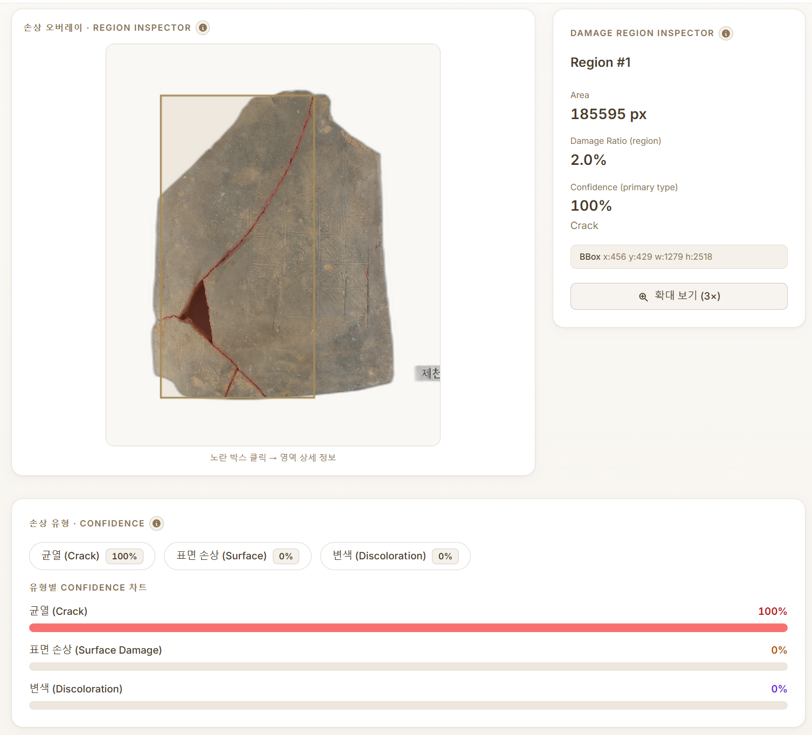 | 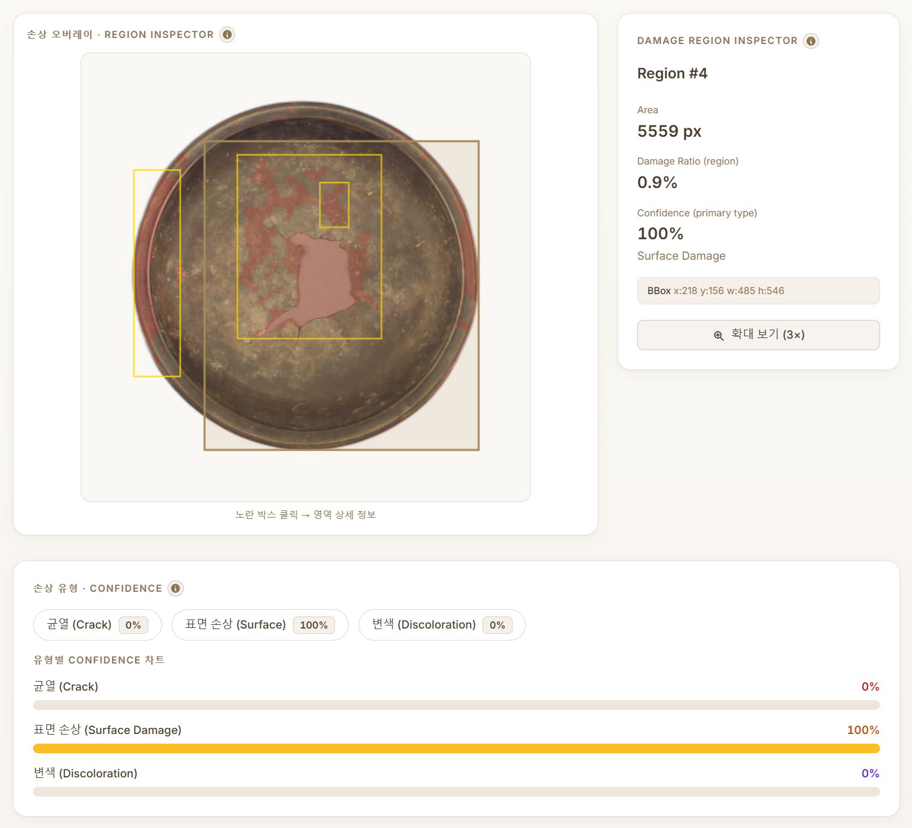 | 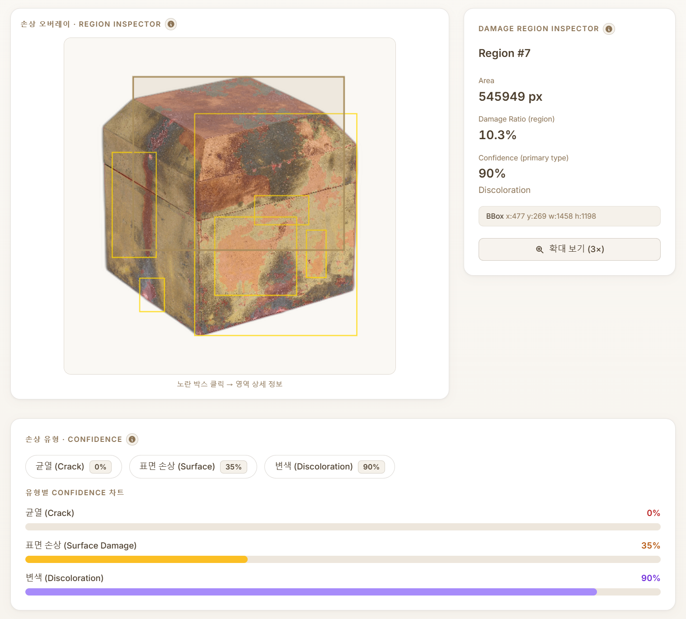 |
| **석제 원형 유물** — 중앙·가장자리 균열 경로 검출 | **청동 그릇** — 표면 박락·결손 영역 검출 | **금속 유물** — 산화·변색 영역 검출 |

| 항목 | 균열 (Crack) | 표면 손상 (Surface Damage) | 변색 (Discoloration) |
|------|-------------|---------------------------|----------------------|
| **Primary Damage Type** | Crack **100%** | Surface Damage **100%** | Discoloration **90%** |
| **Damage Area** | 4.83% | 0.9% (선택 영역) | 10.3% (선택 영역) |
| **Severity** | LOW | — | — |
| **Region Count** | 4개 | — | — |
| **특징** | 균열의 주요 경로와 분기 구간이 오버레이에 표시됨 | 박락·깎임 부위가 bbox로 분리되어 검출됨 | 변색 confidence 90%, 표면 손상 35%로 **복합 손상**도 표현 |

---
#### 3-1. 손상 분석 요약
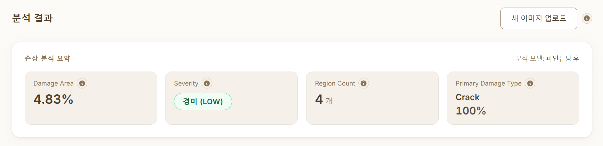
| 항목 | 설명 |
|------|------|
| **Damage Area** | 이미지 전체 대비 손상 픽셀 비율(%) |
| **Severity** | 면적·감지 유형 수를 종합한 `high` / `medium` / `low` / `none` |
| **Region Count** | 분할 마스크에서 분리된 손상 영역(바운딩 박스) 개수 |
| **Primary Damage Type** | `crack` · `surface_damage` · `discoloration` 중 confidence가 가장 높은 유형 |

#### 3-2. 탭별 시각화

**인터랙티브 분석**

| 인터랙티브 캔버스 | 줌 모달 |
|:---:|:---:|
| 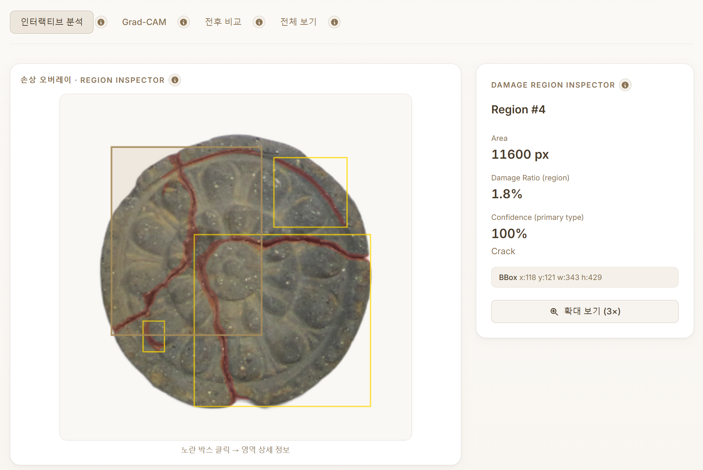 | 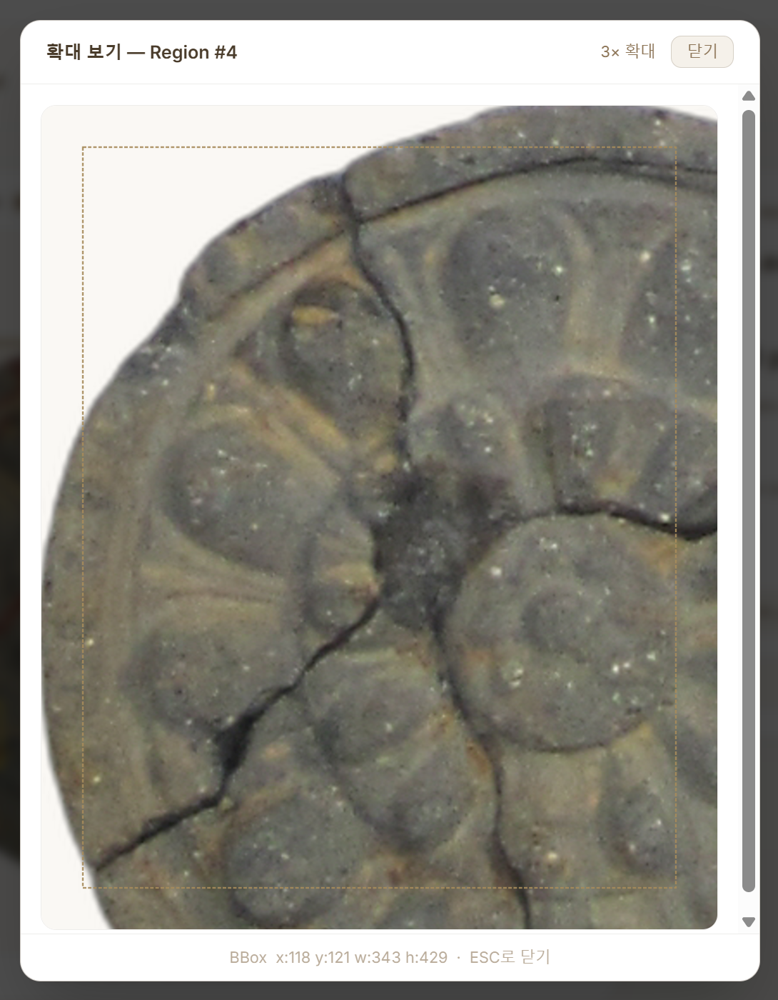 |

원본 위에 손상 오버레이와 노란 bbox가 겹쳐 표시됩니다. 박스를 클릭하면 오른쪽 **Region Inspector**에서 해당 영역의 픽셀 면적·손상 비율·주요 유형 confidence를 확인할 수 있고, **줌 모달**로 선택 영역만 확대해 자세히 살펴볼 수 있습니다.

**Grad-CAM**

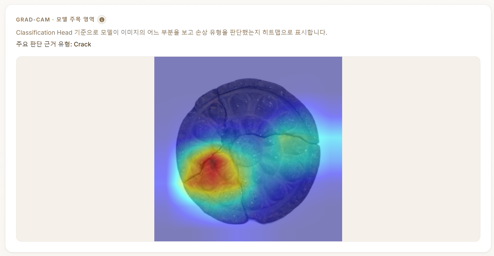

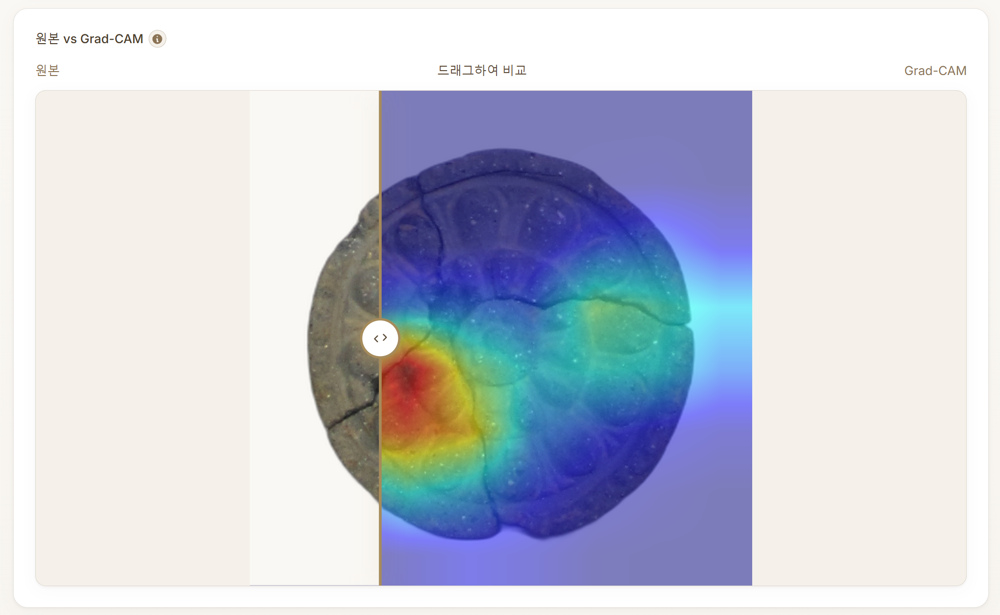

분류 모델이 손상 유형을 판단할 때 주목한 영역을 히트맵으로 보여줍니다. 붉을수록 해당 유형 판단에 더 크게 기여한 영역이며, 원본과 Grad-CAM을 나란히 비교해 모델의 판단 근거를 확인할 수 있습니다.

**전후 비교**

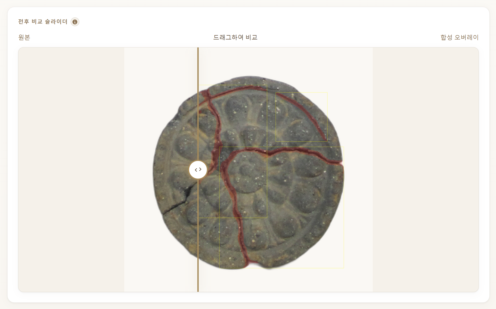

가운데 슬라이더를 좌우로 드래그해 **분석 전(원본)** 과 **분석 후(합성 오버레이)** 를 한 화면에서 겹쳐 비교합니다. 손상 위치가 원본 대비 얼마나 두드러지는지 직관적으로 확인할 수 있습니다.

**전체 보기**

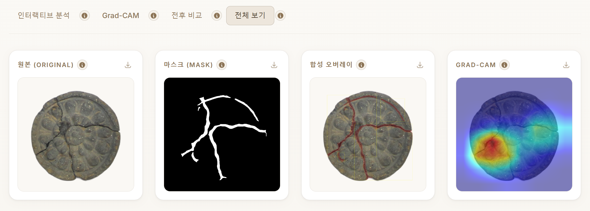

원본·마스크·합성 오버레이·Grad-CAM 네 장을 갤러리 형태로 한눈에 봅니다. 각 이미지는 개별 PNG로 저장할 수 있습니다.

#### 3-3. 손상 유형 · Confidence
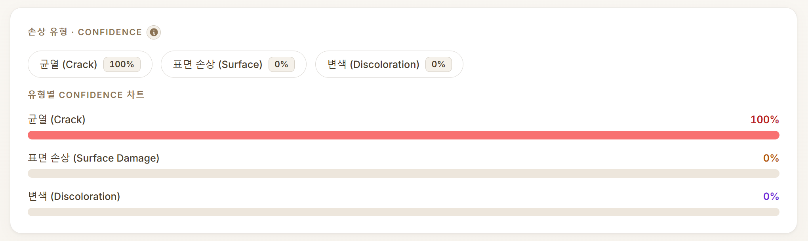

- 이미지 **전체**에 대한 3종 손상 유형별 confidence(0~100%)를 배지·차트로 표시합니다.
- Multi-label Classification이므로 **복합 손상**(균열+변색 등)을 한 장에서 동시에 표현합니다.

#### 3-4. 3D Damage Preview

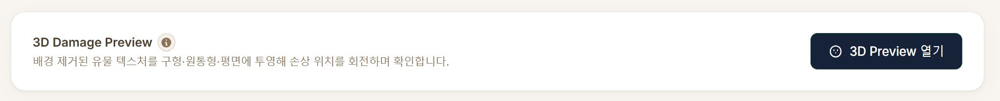

배경 제거된 유물을 **Sphere · Cylinder · 평면(Box)** 형태에 투영해 회전하며 확인할 수 있습니다. 평면 모드는 마스크 displacement로 손상 위치를 미세하게 입체 강조합니다.

> **3D Preview**는 분석 결과 시각화 기능이며, 실제 형상 복원이나 3D 재구성을 수행하지 않는다.

**보기 모드**

| 사진 모드 | 히트맵 모드 |
|:---:|:---:|
| 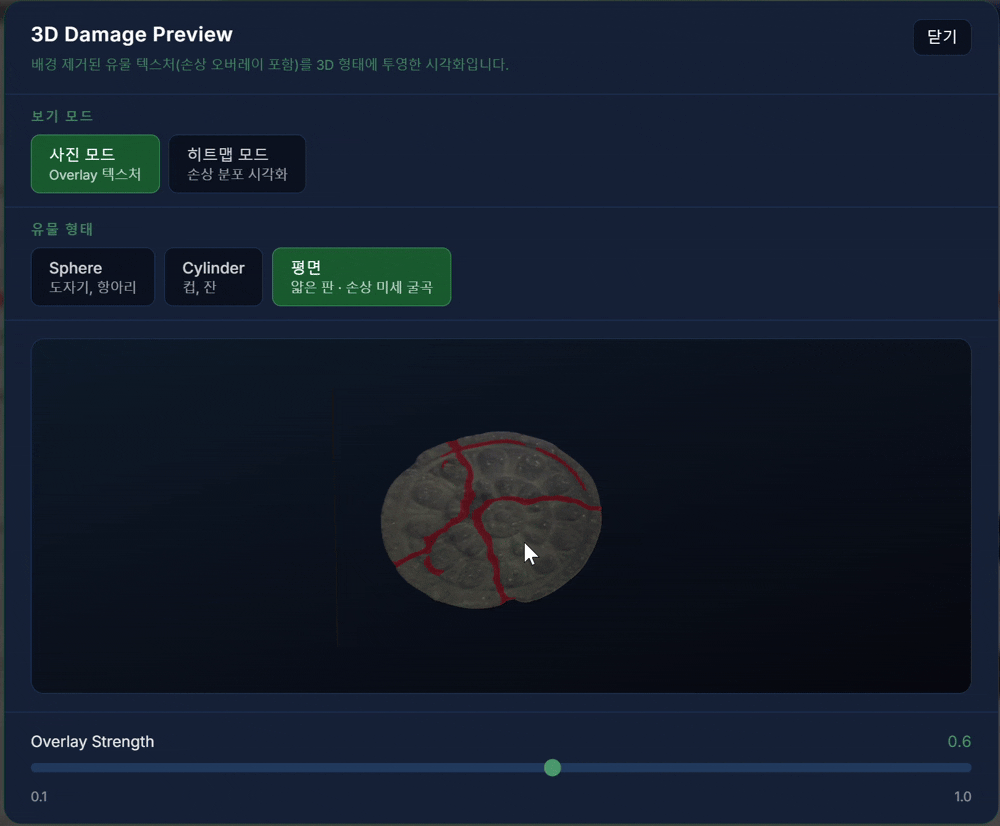 | 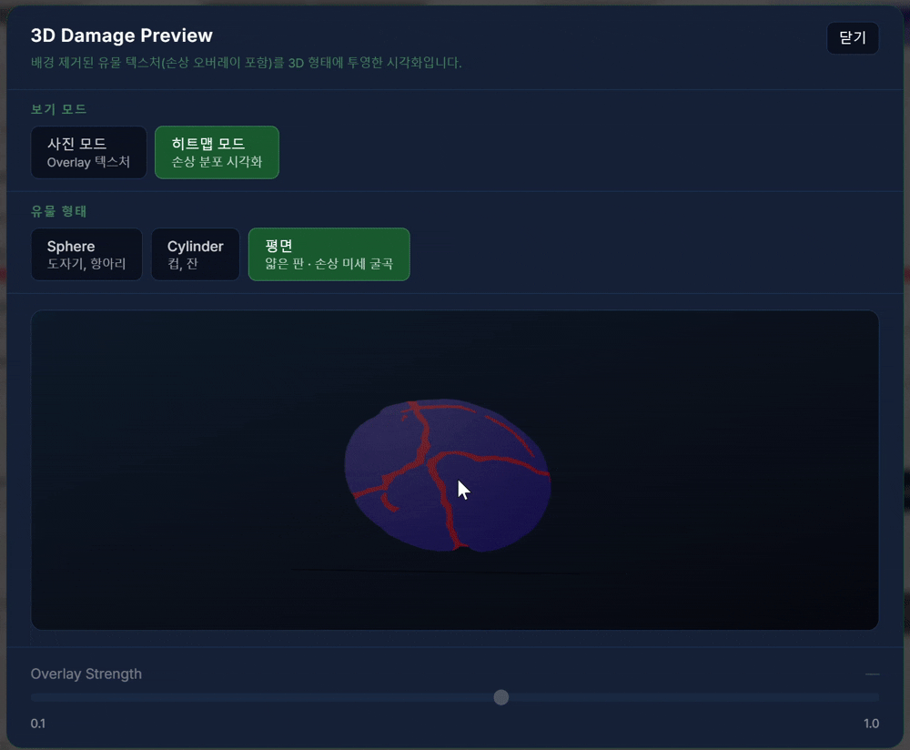 |

- **사진 모드**: 배경 제거된 유물 텍스처와 **손상 오버레이**를 3D 표면에 그대로 입힙니다. 하단 **Overlay Strength** 슬라이더로 오버레이 투명도를 조절해, 실제 유물 사진에 가깝게 손상 위치를 확인할 수 있습니다.
- **히트맵 모드**: Segmentation **마스크**를 jet 컬러맵(파랑 → 초록 → 빨강)으로 변환해 손상 **분포·강도**를 색으로 표시합니다. 유물 실루엣은 유지한 채 손상 영역만 강조되므로, 형태와 무관하게 손상 패턴을 한눈에 비교하기에 유리합니다.

#### 3-5. 분석 보고서 (PDF)

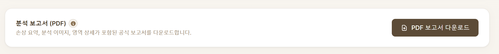
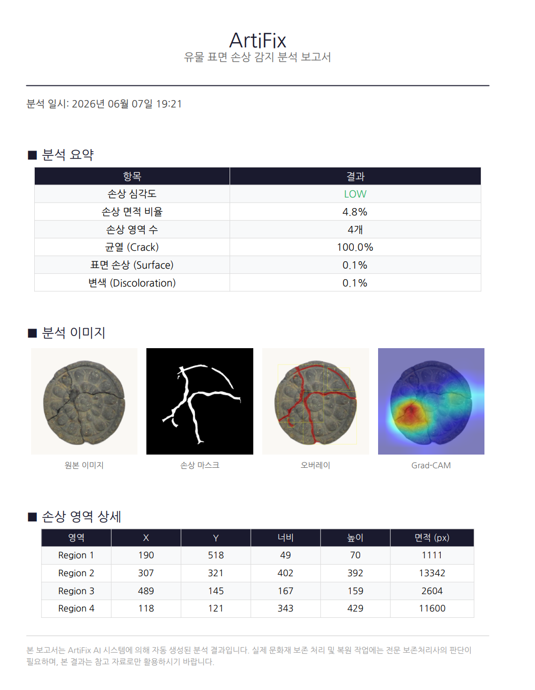

손상 심각도·면적 비율·영역 수·유형별 confidence, 분석 이미지(원본·마스크·오버레이·Grad-CAM), 손상 영역 상세를 **한글 PDF**로 다운로드합니다. 화면에 표시된 분석 옵션(모델·crop·Detection Threshold)과 동일한 설정으로 생성됩니다.

#### 3-6. 분석 이미지 저장

**전체 보기** 탭에서 원본 · 마스크 · 오버레이 · Grad-CAM 각 이미지를 개별 PNG로 저장할 수 있습니다.


#### 3-7 분석 히스토리
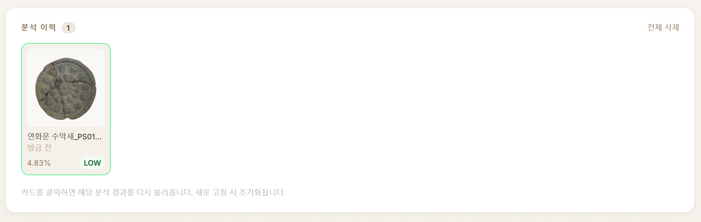
- 현재 **브라우저 탭 세션** 동안 최근 **10건**의 결과를 보관합니다.
- 이전 항목을 클릭해 결과만 다시 열거나, 개별·전체 삭제할 수 있습니다.
- 모델·crop·민감도 등 **옵션**은 LocalStorage에 저장되어 다음 방문 시에도 유지됩니다.

#### 3-8. 모델 비교 (파인튜닝 전 vs 후)

분석 옵션에서 **파인튜닝 전** / **파인튜닝 후**를 바꾼 뒤 **동일 유물 이미지**를 각각 분석하면, Segmentation·요약 수치·Confidence가 어떻게 달라지는지 바로 비교할 수 있습니다. Crop·Detection Threshold는 두 번 모두 **같은 값**으로 맞추는 것이 공정한 비교에 유리합니다.

**비교 절차**

1. 분석 옵션에서 모델·crop·임계값을 설정합니다.
2. 유물 이미지를 업로드해 결과를 확인합니다.
3. **「새 분석」** 으로 옵션만 바꾸거나, 모델을 전환한 뒤 **같은 이미지를 다시 업로드**합니다.
4. 손상 분석 요약·인터랙티브 오버레이·Confidence를 나란히 비교합니다.

**동일 유물 — Segmentation 오버레이 비교**

| 파인튜닝 전 (`best_model.pt`) | 파인튜닝 후 (`best_finetuned.pt`) |
|:---:|:---:|
| 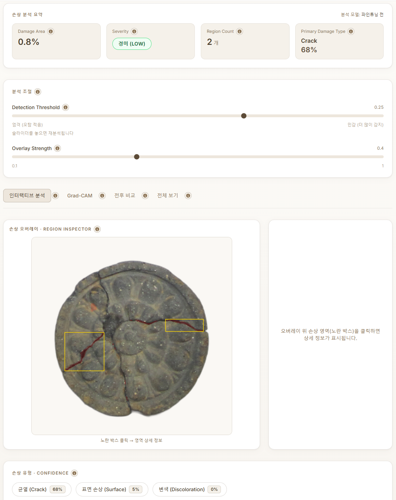 | 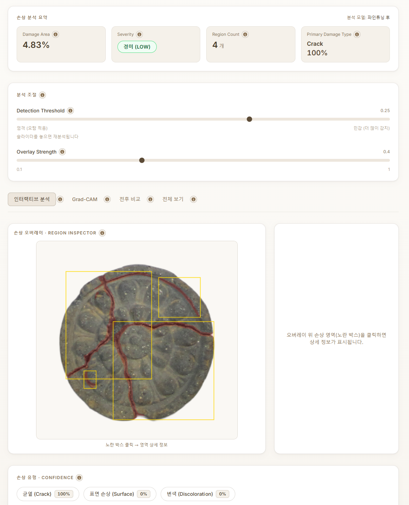 |

> 구체적인 비교 수치·해석은 [5.6 Fine-tuning 전후 Inference 비교](#56-fine-tuning-전후-inference-비교)를 참고하세요.

**무엇이 달라지나**

| 항목 | 파인튜닝 전 | 파인튜닝 후 |
|------|-------------|-------------|
| **학습 도메인** | Crack500(아스팔트·콘크리트) + 합성 데이터 중심 | 위 베이스 + **실제 유물 45장** Segmentation 추가 학습 |
| **Segmentation** | 유물 표면 텍스처·균열형 패턴을 **과검출**하거나, 미세 손상을 **놓치는** 경우가 있음 | 실제 유물 도메인에 맞춰 **손상 영역이 더 안정적**으로 잡히는 경우가 많음 |
| **Damage Area · Severity** | 오탐·미검출에 따라 면적·심각도가 **과대/과소** 추정될 수 있음 | Fine-tuning 후 **실제 손상 위치와 면적**이 더 잘 맞는 경향 |
| **Classification** | 선택한 `best_model.pt` 가중치로 3종 confidence 산출 | 선택한 `best_finetuned.pt` 가중치로 산출 (세그멘테이션과 동일 체크포인트) |
| **한계** | 도메인 갭으로 유물 전용 패턴 적응이 부족 | 일부 **적갈색·거친 표면** 토기에서 정상 영역을 손상으로 오인하는 사례도 있음 |

> Fine-tuning 동기·학습 설정·catastrophic forgetting 대응은 [5. Fine-tuning](#5-fine-tuning-실제-유물-도메인-적응) 절을 참고하세요.

#### 백엔드 산출물 (API·후처리)

결과 화면의 이미지·수치는 FastAPI `/predict` 응답을 기반으로 합니다.

- **Segmentation**: 픽셀 단위 이진 마스크 + 빨간색 오버레이 합성
- **후처리**: rembg/유물 실루엣 기반 `damage_allowed` 마스크로 **배경·유물 외부 오탐 제거**, morphology·hole 필터 적용
- **바운딩 박스**: 연결 요소별 `bboxes` (면적·좌표) — 인터랙티브 캔버스·PDF·Region Inspector에 사용

---

## 실험 과정

### 실험 환경

| 항목 | 내용 |
|---|---|
| GPU | Kaggle T4 x2 |
| Framework | PyTorch 2.x, segmentation-models-pytorch |
| Encoder | EfficientNet-B2 (ImageNet pretrained) |
| Image Size | 256×256 |
| Batch Size | 8 |
| Epochs | 50 |
| Optimizer | AdamW (lr=3e-4, weight_decay=1e-4) |
| Scheduler | CosineAnnealingLR (T_max=NUM_EPOCHS, eta_min=1e-6) |
| Mixed Precision | FP16 (torch.amp.autocast) |
| pos_weight | 데이터 분포 기반 자동 계산 (`(1 - ratio) / ratio`) |

### 1. 데이터셋 구성

#### 1.1 학습 데이터

| 데이터셋 | 설명 | 수량 |
|---|---|---|
| Crack500 | 아스팔트/콘크리트 균열 이미지 | train 1,896장 / val 348장 |
| 합성 데이터 (Synthetic) | 유물 이미지 기반 손상 합성 | train 960장 / val 240장 |

#### 1.2 Val 라벨 분포

| 클래스 | GT Positive | 비율 |
|---|---|---|
| crack | 468개 | 79.6% |
| surface_damage | 120개 | 20.4% |
| discoloration | 120개 | 20.4% |

crack 비율이 높은 이유는 Crack500 val 348장이 전부 `[1, 0, 0]` 라벨이기 때문이다.
합성 데이터 val 240장은 다양한 라벨 조합을 포함한다.

#### 1.3 합성 데이터 파이프라인

e뮤지엄에서 유물 이미지 100장을 직접 수집하였고, 이 이미지들을 픽셀 단위 라벨링하는 것은 현실적으로 시간 비용이 크므로 세 종류의 손상 패턴을 프로그래밍으로 합성하였다.

**손상 유형별 합성 방법**

- **crack**: 랜덤 워크 기반 균열선 생성. 시작점에서 방향각에 누적 노이즈를 더해 자연스러운 곡선 형태를 만들고, 0.5 확률로 분기 패턴을 추가한다. 균열 픽셀의 RGB 명도를 각각 20%, 15%, 10%로 낮춰 어두운 선으로 표현한다.
- **surface_damage**: 불규칙 폴리곤 기반 박락/깨짐 패턴. 랜덤 각도로 꼭짓점을 생성하고 반경에 노이즈를 더해 자연스러운 경계를 만든다. GaussianBlur로 경계를 부드럽게 처리 후 명도를 올려 밝게 표현한다.
- **discoloration**: 여러 불규칙 폴리곤을 누적 합성 후 넓게 블러 처리. 황변(R 강조, B 억제) 또는 청변(G 강조) 중 랜덤 선택해 색상 변화를 표현한다.

**Leakage 방지 설계**

동일 원본 이미지가 train/val에 동시에 등장하는 것을 막기 위해,
원본 100장을 train용(80장) / val용(20장)으로 먼저 분리한 뒤 각각 합성했다.
샘플 단위로 랜덤 분할하면 같은 유물에서 서로 다른 손상 패턴이 train/val에 동시에 들어가
val 성능이 부풀 수 있기 때문이다.

**Damage Config (12종)**

```python
damage_configs = [
    ['crack'], ['surface_damage'], ['discoloration'],
    ['crack', 'surface_damage'], ['crack', 'discoloration'],
    ['surface_damage', 'discoloration'],
    # 위 6종 반복 (총 12종)
]
```

80장 × 12종 = 960장 (train), 20장 × 12종 = 240장 (val)

### 2. 모델 구조



#### 2.1 4채널 입력 설계 근거

Sobel Edge Map을 추가 채널로 넣은 이유는 균열이 강한 에지 신호를 동반하기 때문이다.
명도 변화만으로는 표면 텍스처와 균열을 구분하기 어려운 케이스에서
에지 정보가 보조 신호로 작용할 수 있다는 가설 하에 설계했다.
실제 효과는 Ablation에서 검증했다 (+0.0161 mIoU).

#### 2.2 멀티태스크 학습 설계 근거

Segmentation과 Classification을 동시에 학습하면
encoder가 두 태스크에 유용한 feature를 공유하게 된다.
분류 헤드가 "이 이미지에 crack이 있는가"를 학습하는 과정이
encoder의 표현력을 높여 segmentation에도 긍정적인 영향을 줄 수 있다는 가설 하에 설계했다.
Ablation 결과 +0.0038 mIoU 향상으로 이 가설이 지지되었다.
단, 향상폭이 크지 않아 task interference 가능성도 함께 논의한다 (섹션 4 참조).

#### 2.3 Loss 함수

```
Total Loss = Seg Loss + λ × Cls Loss    (λ = 0.5)

Seg Loss = DiceLoss + BCEWithLogitsLoss(pos_weight)
Cls Loss = BCEWithLogitsLoss()
```

**pos_weight 자동 계산**

```python
ratio      = foreground_pixels / total_pixels
pos_weight = (1 - ratio) / ratio
```

train DataLoader 전체를 순회해 foreground 픽셀 비율을 측정하고 자동 산출한다.
이는 데이터 분포가 실험마다 다를 수 있으므로 하드코딩을 피하기 위함이다.

**파인튜닝 전략**: 45장의 실제 유물 이미지로 Segmentation만 추가 학습합니다. 상세 설정·가중치 분리 방식은 [5. Fine-tuning](#5-fine-tuning-실제-유물-도메인-적응) 절을 참고하세요.

### 3. Ablation Study

#### 3.1 실험 설계

각 기술 요소의 독립적인 기여도를 측정하기 위해 4단계 누적 실험을 수행했다.
기존 설정에 요소를 하나씩 추가하는 방식으로, 이전 실험의 best 설정을 유지한다.

| 실험 | USE_SOBEL | USE_MULTITASK | USE_SYNTHETIC | IN_CHANNELS |
|---|---|---|---|---|
| Baseline | False | False | False | 3 |
| +Synthetic | False | False | True | 3 |
| +Sobel | True | False | True | 4 |
| +Multitask | True | True | True | 4 |

모든 실험에서 pos_weight는 해당 실험의 train 데이터 분포로 자동 계산했다.

#### 3.2 최종 결과

| 실험 | Best mIoU | Best Dice | Best F1 | Best Epoch |
|---|---|---|---|---|
| Baseline | 0.6520 | 0.7870 | — | 29 |
| +Synthetic | 0.6565 | 0.7868 | — | 42 |
| +Sobel | 0.6726 | 0.7993 | — | 38 |
| **+Multitask** | **0.6764** | **0.8028** | **0.9808** | 46 |

| Baseline | +Synthetic Data |
|:---:|:---:|
| 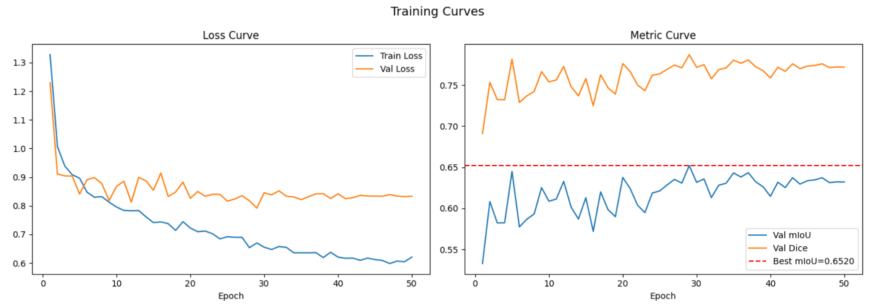 | 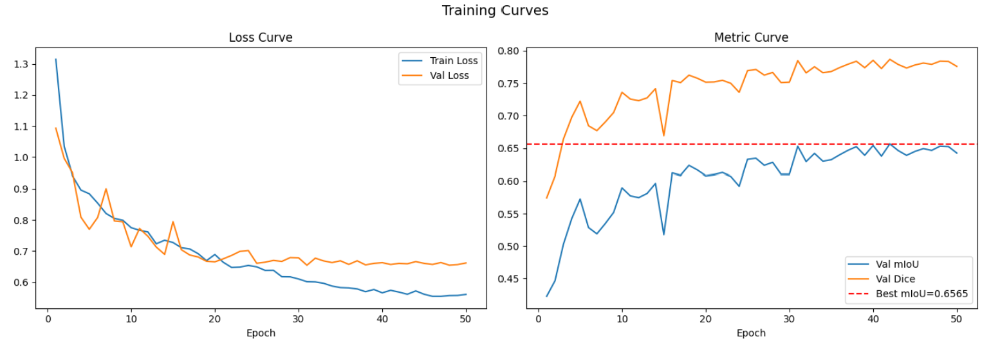 |
| mIoU 0.6520 | mIoU 0.6565 (+0.0045) |

| +Sobel Edge | +Multitask |
|:---:|:---:|
| 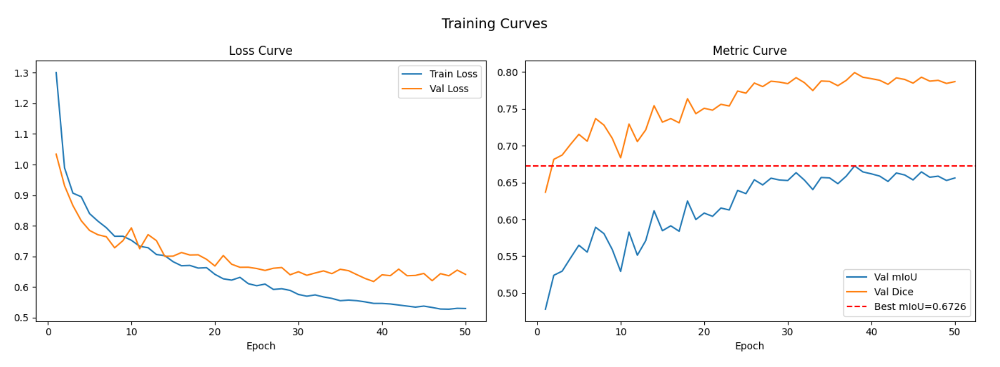 | 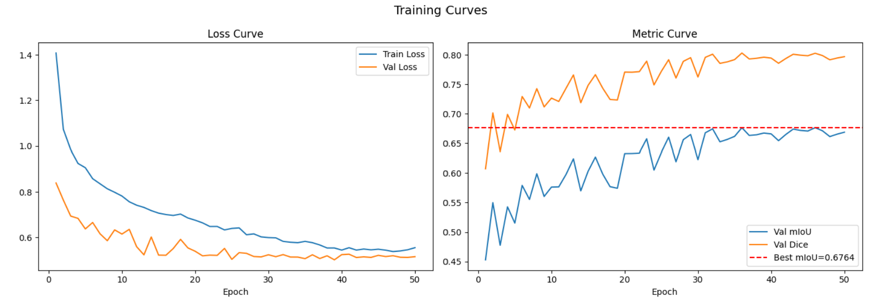 |
| mIoU 0.6726 (+0.0161) | mIoU **0.6764** (+0.0038) |

#### 3.3 단계별 분석

| 변화 | mIoU 향상 | 비고 |
|---|---|---|
| Baseline → +Synthetic | +0.0045 (+0.7%) | 합성 데이터의 도메인 다양성 효과 |
| +Synthetic → +Sobel | +0.0161 (+2.5%) | 에지 정보가 균열 검출에 기여 |
| +Sobel → +Multitask | +0.0038 (+0.6%) | 분류 태스크 공동 학습의 소폭 기여 |
| **전체** | **+0.0244 (+3.7%)** | |

#### 3.4 Baseline 상세 로그

- Train 데이터: Crack500 1,896장
- Best mIoU: **0.6520** (Epoch 29)
- Best Dice: **0.7870**
- 특이사항: USE_MULTITASK=False라 F1=0.0000 (classification 미수행)

주요 에폭:
```
[02/50] mIoU: 0.6083 | Dice: 0.7533
[05/50] mIoU: 0.6449 | Dice: 0.7815
[29/50] mIoU: 0.6520 | Dice: 0.7870  ← Best
[50/50] mIoU: 0.6320 | Dice: 0.7718
```

관찰: 29 에폭에서 best를 기록한 후 이후 에폭에서 소폭 하락하며 0.63~0.64 수준에서 진동.
Crack500만으로는 학습 데이터 다양성이 부족해 일반화 성능이 제한적임을 시사한다.

#### 3.5 +Synthetic 상세 로그

- Train 데이터: Crack500 1,896 + Synthetic 960 = 2,856장
- Best mIoU: **0.6565** (Epoch 42)
- Best Dice: **0.7868**
- Baseline 대비: mIoU +0.0045

주요 에폭:
```
[05/50] mIoU: 0.5725 | Dice: 0.7224
[10/50] mIoU: 0.5896 | Dice: 0.7360
[31/50] mIoU: 0.6529 | Dice: 0.7849
[42/50] mIoU: 0.6565 | Dice: 0.7868  ← Best
[50/50] mIoU: 0.6424 | Dice: 0.7760
```

관찰: Baseline보다 수렴이 느리다. 합성 데이터가 포함되면서 데이터 다양성이 높아져
모델이 더 많은 에폭을 필요로 하는 것으로 해석된다.
향상폭(+0.0045)이 작은 이유는 합성 데이터가 실제 Crack500 텍스처와 다른 도메인이라
직접적인 val 성능 향상으로 이어지기 어렵기 때문이다.
그러나 classification 라벨 다양성 측면에서는 이후 멀티태스크 실험에 필수적이다.

#### 3.6 +Sobel 상세 로그

- Train 데이터: 2,856장 (4채널 RGB+Sobel)
- Best mIoU: **0.6726** (Epoch 38)
- Best Dice: **0.7993**
- +Synthetic 대비: mIoU +0.0161

주요 에폭:
```
[07/50] mIoU: 0.5893 | Dice: 0.7368
[14/50] mIoU: 0.6117 | Dice: 0.7544
[26/50] mIoU: 0.6537 | Dice: 0.7850
[38/50] mIoU: 0.6726 | Dice: 0.7993  ← Best
[50/50] mIoU: 0.6562 | Dice: 0.7870
```

관찰: Sobel 추가로 4단계 실험 중 가장 큰 단일 향상폭을 보였다(+0.0161).
균열은 강한 에지 신호를 동반하므로 Sobel edge map이 encoder의 균열 특징 추출에
직접적으로 기여했음을 시사한다.
Best가 38 에폭으로 늦게 나타난 점은 4채널 입력에 대한 적응 기간이 필요함을 의미한다.

#### 3.7 +Multitask 상세 로그

- Train 데이터: 2,856장 (4채널, Seg + Cls 공동 학습)
- Best mIoU: **0.6764** (Epoch 46)
- Best Dice: **0.8028**
- Best F1: **0.9808**
- +Sobel 대비: mIoU +0.0038

주요 에폭:
```
[08/50] mIoU: 0.5990 | Dice: 0.7427 | F1: 0.9850
[13/50] mIoU: 0.6243 | Dice: 0.7659 | F1: 0.9919
[32/50] mIoU: 0.6744 | Dice: 0.8011 | F1: 0.9784
[36/50] mIoU: 0.6763 | Dice: 0.8032 | F1: 0.9814
[46/50] mIoU: 0.6764 | Dice: 0.8028 | F1: 0.9808  ← Best
[50/50] mIoU: 0.6687 | Dice: 0.7970 | F1: 0.9825
```

관찰: mIoU 향상폭이 +0.0038로 가장 작다. 이는 멀티태스크 학습에서
classification loss가 segmentation 학습에 일부 간섭(task interference)을 일으킬 수 있음을 시사한다.
Dice가 0.80을 돌파했으며, F1은 0.98로 classification 성능이 매우 높다.
val loss가 0.5 수준으로 다른 실험 대비 크게 낮아진 점이 특징적이다.

### 4. Ablation 결과 해석 및 논의

#### 4.1 Sobel > Multitask 현상

+Sobel(0.6726)이 +Multitask(0.6764)보다 단계 기여도가 더 크다.
이는 균열 검출에서 에지 정보가 classification 공동 학습보다 더 직접적인 효과를 가짐을 의미한다.

멀티태스크의 향상폭이 작은 원인으로 두 가지를 고려할 수 있다.

1. **Task interference**: classification loss(λ=0.5)가 segmentation 최적화를 방해할 수 있다. λ 값 조정 실험이 이를 검증할 수 있으나 시간 제약으로 수행하지 못했다.
2. **라벨 불균형**: val의 79.6%가 crack 단일 클래스라 classification 학습이 segmentation 개선에 기여하는 효과가 제한적일 수 있다.

#### 4.2 Classification 성능 (F1 0.9808)

F1 수치는 threshold sweep을 통해 검증했다.

| Threshold | 평균 F1 | crack | surface_damage | discoloration |
|---|---|---|---|---|
| 0.2 | 0.9731 | 0.995 | 0.984 | 0.941 |
| 0.3 | 0.9743 | 0.995 | 0.983 | 0.945 |
| 0.4 | 0.9754 | 0.995 | 0.979 | 0.952 |
| 0.5 | 0.9754 | 0.995 | 0.979 | 0.952 |
| **0.6** | **0.9767** | **0.995** | **0.979** | **0.956** |

클래스별 최적 threshold:

| 클래스 | 최적 threshold | F1 |
|---|---|---|
| crack | 0.1 | 0.9968 |
| surface_damage | 0.7 | 0.9874 |
| discoloration | 0.7 | 0.9600 |

discoloration의 최적 threshold가 높은 것은 val 내 discoloration 샘플 수(120개)가
crack(468개)보다 적고, 합성 discoloration 패턴이 실제 변색과 차이가 있어
모델이 더 신중하게 판단할 때 정확도가 높아지기 때문으로 해석된다.

### 5. Fine-tuning (실제 유물 도메인 적응)

#### 5.1 동기

Crack500은 아스팔트/콘크리트 균열 데이터셋이다.
학습된 모델을 실제 유물 이미지에 적용하면 텍스처 도메인이 달라
segmentation 품질이 떨어진다.
이를 완화하기 위해 실제 유물 이미지 소량을 직접 라벨링해 fine-tuning을 수행했다.

#### 5.2 라벨링 데이터

- **도구**: Label Studio (Brush 툴, 픽셀 단위 binary mask)
- **최종 데이터**: 45장
  - 손상 유물 31장 (균열, 박락, 결손 포함)
  - 정상 유물 14장 (negative sample, mask = 전부 0)

**Negative sample 추가 이유**

손상이 없는 거친 표면이나 적갈색 토기 표면을 손상으로 잡는 false positive 문제가 관찰되었다.
"손상 없는 거친 표면" 이미지를 빈 마스크(`mask=0`)와 함께 추가함으로써
모델이 "거친 표면 = 정상"을 학습하도록 했다.

#### 5.3 Fine-tuning 설정

```python
FINETUNE_EPOCHS = 10
FINETUNE_LR     = 1e-5       # 기존 가중치를 크게 변형하지 않도록 낮게 설정
Loss            = DiceLoss + BCEWithLogitsLoss  # pos_weight 없이 단순화
```

**Classification loss 제외 근거**

라벨링 데이터의 cls_label이 모두 `[0, has_damage, 0]`으로 단순화되어
분류 학습에 노이즈가 될 수 있다.
Fine-tuning의 목적이 segmentation 도메인 적응이므로 seg loss만 사용하는 것이 적절하다.

#### 5.4 Fine-tuning 결과

```
RealArtifactDataset: 45개
[FT 01/10] seg_loss: 1.1918
[FT 02/10] seg_loss: 1.0552
[FT 04/10] seg_loss: 0.9887
[FT 06/10] seg_loss: 0.9792
[FT 08/10] seg_loss: 0.9777  ← Best
🏁 Fine-tuning 완료 — Best loss: 0.9777
```

DiceLoss + BCEWithLogitsLoss 합산 기준 1.0 이하로 수렴해 정상 학습이 확인되었다.

#### 5.5 Catastrophic Forgetting 대응

Fine-tuning 후 inference 결과에서 classification confidence가 낮아지는 현상이 관찰되었다.
Fine-tuned 모델이 유물 도메인 segmentation에 특화된 반면,
기존 best_model이 학습한 classification 표현이 손상된 것으로 판단했다.

이를 해결하기 위해 두 모델을 분리해 사용하는 방식을 채택했다.

```
seg_model = best_finetuned.pt  → Segmentation (유물 도메인 적응)
cls_model = best_model.pt      → Classification (원래 성능 유지)
```

두 모델을 동시에 로드해 각각의 출력만 사용하는 방식으로,
재학습 없이 두 태스크 모두의 성능을 최대한 유지했다.

#### 5.6 Fine-tuning 전후 Inference 비교

동일한 유물 이미지(균열이 있는 석제 원형 유물)에 대해 fine-tuning 전후 모델의 Segmentation 결과를 비교했다.

| 항목 | 파인튜닝 전 (`best_model.pt`) | 파인튜닝 후 (`best_finetuned.pt`) |
|------|-------------------------------|-----------------------------------|
| **Damage Area** | 0.8% | 4.83% |
| **Region Count** | 2개 | 4개 |
| **Severity** | LOW | LOW |
| **Segmentation** | 균열의 일부 구간만 검출, 오버레이에서 균열 선이 불완전하게 표시 | 균열의 주요 경로가 전체적으로 검출, 분기 부분까지 포함해 더 완전한 마스크 생성 |

**해석**

- fine-tuning 전 모델은 Crack500(아스팔트/콘크리트) 도메인에 편향되어 있어 유물 표면의 균열을 일부만 감지했다.
- 실제 유물 이미지 45장(손상 31장 + 정상 14장)으로 fine-tuning한 결과, 유물 도메인의 균열 패턴에 대한 적응이 이루어져 검출 면적과 영역 수가 크게 향상되었다.
- Severity는 두 모델 모두 LOW로 동일하나, 실제 감지된 손상 면적은 약 6배 차이를 보인다.

| 파인튜닝 전 | 파인튜닝 후 |
|:---:|:---:|
|  |  |

> 정량 평가 데이터가 부족해 mIoU 비교는 수행하지 못했으며, 실제 유물 이미지에서의 **정성 비교**를 통해 효과를 확인하였다. 웹 UI에서 `파인튜닝 전` / `파인튜닝 후` 모델을 전환해 동일 이미지를 비교할 수 있으며, 사용 방법은 [3-8. 모델 비교](#3-8-모델-비교-파인튜닝-전-vs-후)를 참고하세요.

### 6. 추론 파이프라인

```
업로드 이미지 (JPG / PNG)
        │
        ▼
  [Crop 전처리]
  rembg: U²-Net 배경 제거 → 아이보리 배경 합성 → tight bbox crop
  legacy: HSV·Otsu·엣지 기반 crop
        │
        ▼
  [4채널 텐서 생성]
  RGB 정규화 + Sobel Edge 계산 → (4, 256, 256)
        │
        ▼
  [멀티스케일 TTA 추론]
  384 / 448 / 512px 각 스케일에서 원본 + 좌우반전 + 상하반전 예측
  총 9회 sigmoid 확률 평균 → 안정적인 마스크
        │
        ▼
  [후처리]
  ├── MORPH_CLOSE (3×3 kernel): 균열 단절 완화
  ├── damage_allowed 마스크: 유물 외부 오탐 제거
  ├── hole 검출 (규칙 기반): 유물 내부 결손 보완
  └── 연결 요소 분석: 바운딩 박스 목록 생성
        │
        ▼
  [산출물]
  mask, overlay, gradcam,
  artifact_image (투명 RGBA), artifact_overlay_image (손상+유물 RGBA),
  labels, bboxes, damage_ratio, severity
```

재학습 없이 추론 단계에서 segmentation 품질을 개선하기 위한 방법들을 적용했다.

#### 6.1 Test Time Augmentation (TTA)

원본 이미지 외에 좌우반전, 상하반전 버전으로도 예측한 뒤 sigmoid 확률을 평균했다.
classification도 동일하게 TTA를 적용했다.

```python
seg_prob = (sigmoid(pred_orig) +
            sigmoid(pred_flip_lr) +
            sigmoid(pred_flip_ud)) / 3.0

cls_prob = (sigmoid(cls_orig) +
            sigmoid(cls_flip_lr) +
            sigmoid(cls_flip_ud)) / 3.0
```

단일 예측보다 안정적인 마스크를 얻을 수 있다.

#### 6.2 Multi-scale Inference

256 단일 스케일에서는 얇은 균열이 resize 과정에서 소실될 수 있다.
384, 448, 512 세 스케일로 별도 예측 후 256으로 리사이즈해 평균했다.

```python
scales = [384, 448, 512]
seg_prob_final = mean([predict_at_scale(s) for s in scales])
```

각 스케일에서 TTA도 함께 적용했다 (스케일당 3회 예측, 총 9회 평균).
이미지 해상도 256의 제약을 추론 단계에서 부분적으로 보완하는 방법이다.

#### 6.3 Morphological 후처리

얇은 균열이 끊기는 현상을 줄이기 위해 3×3 kernel로 MORPH_CLOSE를 1회 적용했다.
Kernel을 크게 하면 마스크가 번지므로 최소한으로 유지했다.

```python
kernel = np.ones((3, 3), np.uint8)
mask = cv2.morphologyEx(mask, cv2.MORPH_CLOSE, kernel, iterations=1)
```

#### 6.4 내부 결손(Hole) 검출 — 하이브리드 접근

유물 내부의 구멍/결손 영역은 딥러닝 모델이 일관되게 검출하기 어렵다.
이런 영역의 특성은 "유물 실루엣 내부에 배경색이 보인다"는 것이므로
규칙 기반으로 안정적으로 검출할 수 있다.

```python
hole_mask  = detect_internal_holes(cropped_rgb)
final_mask = np.maximum(model_mask, hole_mask)
```

딥러닝 segmentation + 규칙 기반 후처리의 조합은
모델이 잡지 못하는 케이스를 보완하는 견고한 설계 방식이다.

#### 6.5 배경 제거 (rembg)

초기에는 HSV 임계값, Otsu 이진화, Adaptive threshold를 조합한 규칙 기반 crop을 사용했다.
그러나 회색 배경, 그림자, 받침대 등 다양한 배경 조건에서 crop 품질이 불안정했다.

이를 `rembg` (ONNX 기반 U²-Net)로 교체했다.
rembg는 학습된 AI 배경 제거 모델로, 복잡한 배경 조건에서도 안정적인 유물 실루엣 추출이 가능하다.

```python
from rembg import remove
output = remove(pil_img)  # RGBA 출력
alpha  = output[:, :, 3]  # 유물 영역 마스크
```

배경 제거 결과의 alpha 채널을 유물 마스크로 활용해 유물 외부의 false positive도 제거했다.

### 7. 개선 시도 및 실패 사례

#### 7.1 seamlessClone 기반 합성 데이터 개선

**시도**

`cv2.seamlessClone`으로 Crack500 이미지에서 추출한 실제 균열 패치를
유물 이미지에 자연스럽게 합성하면 더 현실적인 학습 데이터를 만들 수 있다는
가설 하에 실험했다.

**결과**

동일 조건(50 에폭, +Multitask 설정)에서 best mIoU 0.6216으로,
기존 legacy 방식의 0.6764보다 낮게 나왔다.

**원인 분석**

Crack500은 아스팔트/콘크리트 텍스처이고 유물 이미지는 도자기/금속/석재 텍스처다.
seamlessClone이 픽셀 수준의 경계를 자연스럽게 합성하더라도,
두 도메인의 텍스처 자체가 달라 합성 데이터의 균열 패턴이 오히려 더 비자연스러웠을 가능성이 있다.
또한 seamlessClone 패치의 균열 면적이 legacy 방식보다 작아
foreground 픽셀 비율이 낮아지고 pos_weight가 높아진 점도 영향을 주었다.

**결론**

이 시도는 롤백하고 기존 best_model.pt를 최종 모델로 사용했다.
"실제 패치 합성이 반드시 더 좋은 것은 아니다"는 교훈을 남겼다.

---

## 시스템 아키텍처

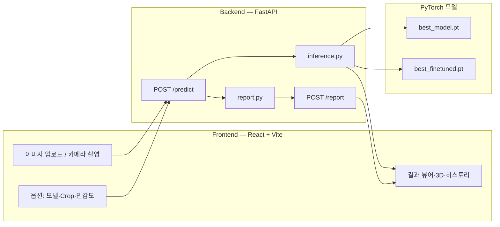
```mermaid
flowchart LR
  subgraph client [Frontend — React + Vite]
    Upload[이미지 업로드 / 카메라 촬영]
    Options[옵션: 모델·Crop·민감도]
    Viewer[결과 뷰어·3D·히스토리]
  end

  subgraph server [Backend — FastAPI]
    Predict[POST /predict]
    Report[POST /report]
    Inf[inference.py]
    Rep[report.py]
  end

  subgraph model [PyTorch 모델]
    Base[best_model.pt]
    FT[best_finetuned.pt]
  end

  Upload --> Predict
  Options --> Predict
  Predict --> Inf
  Inf --> Base
  Inf --> FT
  Inf --> Viewer
  Predict --> Rep
  Rep --> Report
  Report --> Viewer
```

---

## 기술 스택

| 영역 | 기술 |
|------|------|
| **딥러닝 프레임워크** | PyTorch, segmentation-models-pytorch |
| **데이터 증강** | Albumentations |
| **이미지 처리** | OpenCV, NumPy, Pillow |
| **배경 제거** | rembg (ONNX Runtime, U²-Net) |
| **API 서버** | FastAPI, Uvicorn |
| **PDF 생성** | ReportLab |
| **프론트엔드** | React 18, Vite 6, Tailwind CSS 3 |
| **3D 렌더링** | Three.js (OrbitControls) |
| **라우팅** | React Router v6 |
| **학습 환경** | Kaggle (T4 GPU), Python 3.10+ |

---

## 프로젝트 구조

```
ArtiFix/
├── backend/
│   ├── main.py            # FastAPI 앱, CORS, /predict · /report · /health
│   ├── inference.py       # 모델 정의, crop, 멀티스케일 TTA 추론, 후처리
│   ├── report.py          # PDF 보고서 생성 (ReportLab)
│   ├── utils.py           # 공통 유틸리티
│   ├── requirements.txt
│   ├── NanumGothic.ttf    # PDF 한글 폰트
│   └── weights/           # 학습 가중치 (Kaggle artifix-weights에서 다운로드)
│       ├── best_model.pt
│       └── best_finetuned.pt
│
├── frontend/
│   ├── src/
│   │   ├── api/
│   │   │   └── api.js              # predict · report · mock API
│   │   ├── pages/
│   │   │   ├── Home.jsx            # 메인 분석 페이지
│   │   │   └── About.jsx           # 모델·스택 소개 페이지
│   │   ├── components/
│   │   │   ├── ImageUploader.jsx   # 파일 드래그·드롭 업로더
│   │   │   ├── CameraModal.jsx     # 웹캠 촬영 모달
│   │   │   ├── UploadOptions.jsx   # 모델·Crop·AutoCrop 옵션
│   │   │   ├── AnalysisControls.jsx# 민감도 슬라이더 (변경 시 재분석)
│   │   │   ├── ResultViewer.jsx    # 결과 탭 뷰 (4개 탭)
│   │   │   ├── InteractiveCanvas.jsx # bbox 오버레이·클릭 인터랙션
│   │   │   ├── RegionInspector.jsx # 선택 영역 상세 정보
│   │   │   ├── GradCamPanel.jsx    # Grad-CAM 시각화
│   │   │   ├── CompareSlider.jsx   # 전후 비교 슬라이더
│   │   │   ├── ThreeDPreviewModal.jsx # Three.js 3D 뷰어 모달
│   │   │   ├── ArtifactViewer3D.jsx   # 3D 렌더러 (Sphere·Cylinder·평면)
│   │   │   ├── ConfidenceChart.jsx # 손상 유형별 신뢰도 차트
│   │   │   ├── HistoryPanel.jsx    # 최근 분석 히스토리
│   │   │   ├── ZoomModal.jsx       # 이미지 확대 모달
│   │   │   ├── SeverityBadge.jsx   # 심각도 배지
│   │   │   ├── DamageTypeBadge.jsx # 손상 유형 배지
│   │   │   ├── ReportDownloadButton.jsx # PDF 다운로드
│   │   │   ├── InfoTooltip.jsx     # (i) 툴팁
│   │   │   ├── Header.jsx
│   │   │   └── Footer.jsx
│   │   └── utils/
│   │       ├── featureHelp.js      # 툴팁 설명 텍스트
│   │       ├── damageLabels.js     # 손상 유형 레이블·색상 매핑
│   │       ├── canvasUtils.js      # 캔버스 합성 유틸
│   │       ├── build3dTexture.js   # Three.js 텍스처 생성
│   │       ├── useLocalStorage.js  # LocalStorage 커스텀 훅
│   │       └── useScrollAnimation.js # 스크롤 애니메이션 훅
│   ├── package.json
│   └── vite.config.js
│
├── real_dataset/      # fine-tuning 데이터 (Kaggle real-dataset에서 다운로드)
├── docs/              # 아키텍처 다이어그램·UI 스크린샷 등 문서 자료
├── image/             # 합성 데이터 원본 유물 100장 (Kaggle artifix-artifacts)
└── README.md
```

---

## 실행 방법

### 사전 요구 사항

- Python 3.10 이상
- Node.js 18 이상
- CUDA 지원 GPU (선택, 없으면 CPU 추론)
- 학습 가중치: `backend/weights/best_model.pt`, `best_finetuned.pt` — [Kaggle에서 다운로드](#가중치데이터)

### 백엔드

```bash
cd backend

# 가상 환경 생성·활성화
python -m venv venv
venv\Scripts\activate        # Windows
# source venv/bin/activate   # macOS / Linux

pip install -r requirements.txt

# 서버 실행
uvicorn main:app --reload --port 8000
```

> rembg 첫 실행 시 `u2net.onnx`를 자동 다운로드합니다 (약 170 MB).  
> 서버 충돌 시 브라우저에서 CORS 오류처럼 보일 수 있으니 터미널 로그를 먼저 확인하세요.

- 헬스 체크: `http://localhost:8000/health`
- API 문서 (Swagger): `http://localhost:8000/docs`

### 프론트엔드

```bash
cd frontend
npm install
npm run dev
```

기본 주소: `http://localhost:5173`

백엔드 연동을 위해 `frontend/.env` (또는 `.env.local`)을 생성합니다.

```env
VITE_API_BASE_URL=http://localhost:8000
VITE_USE_MOCK_API=false
```

백엔드 없이 UI만 확인하려면 `VITE_USE_MOCK_API=true`로 설정하면 더미 응답이 반환됩니다.

### 프로덕션 빌드

```bash
cd frontend
npm run build
npm run preview   # http://localhost:4173
```

---

## API 명세

### `GET /health`

서버 상태·로드된 모델·기본 설정을 확인합니다.

```json
{
  "status": "ok",
  "models": ["base", "finetuned"],
  "default_model_variant": "finetuned",
  "crop_modes": ["rembg", "legacy"],
  "default_crop_mode": "rembg"
}
```

---

### `POST /predict`

**Content-Type:** `multipart/form-data`

#### 요청 파라미터

| 필드 | 타입 | 기본값 | 설명 |
|------|------|--------|------|
| `image` | file | 필수 | JPG / PNG |
| `seg_threshold` | float | `0.10` | Segmentation 이진화 임계값 (0.05 ~ 0.30) |
| `use_auto_crop` | string | `"true"` | 유물 자동 crop 사용 여부 |
| `model_variant` | string | `"finetuned"` | `"base"` \| `"finetuned"` |
| `crop_mode` | string | `"rembg"` | `"rembg"` \| `"legacy"` |

#### 응답 (주요 필드)

| 필드 | 타입 | 설명 |
|------|------|------|
| `original_image` | base64 PNG | crop된 RGB 이미지 |
| `artifact_image` | base64 PNG | 배경 제거 유물 RGBA |
| `artifact_overlay_image` | base64 PNG | 유물 + 손상 오버레이 RGBA |
| `mask_image` | base64 PNG | 손상 마스크 시각화 |
| `overlay_image` | base64 PNG | 손상 오버레이 합성 이미지 |
| `gradcam_image` | base64 PNG | Grad-CAM 히트맵 |
| `labels` | object | `{ crack, surface_damage, discoloration }` 신뢰도 (0~1) |
| `damage_ratio` | float | 손상 픽셀 비율 (%) |
| `severity` | string | `"high"` \| `"medium"` \| `"low"` \| `"none"` |
| `bboxes` | array | `[{ x, y, w, h, area }, ...]` |
| `model_variant` | string | 실제 사용된 모델 ID |

---

### `POST /report`

`/predict`와 동일한 form 필드를 받아 분석 후 **PDF 파일 바이너리**를 반환합니다.  
응답 헤더: `Content-Type: application/pdf`

---

## 프론트엔드 UI

분석 옵션·결과 탭·3D Preview·히스토리 등 UI 상세는 [주요 기능](#주요-기능) 절에 정리되어 있습니다. 컴포넌트 구조는 [프로젝트 구조](#프로젝트-구조)의 `frontend/src/components/`를 참고하세요.

---

## 환경 변수

### 프론트엔드 (`frontend/.env`)

| 변수 | 기본값 | 설명 |
|------|--------|------|
| `VITE_API_BASE_URL` | `http://localhost:8000` | 백엔드 서버 주소 |
| `VITE_USE_MOCK_API` | `false` | `true` 시 더미 응답 반환 (백엔드 불필요) |

### 백엔드

별도 `.env` 없이 `main.py` / `inference.py` 내 상수로 동작합니다.  
CUDA가 설치된 환경에서는 PyTorch가 자동으로 GPU를 감지합니다.

---

## 가중치·데이터

GitHub 저장소 용량 제한(100 MB)으로 **학습 가중치**, **fine-tuning 데이터**, **합성 데이터 원본 유물 사진**은 저장소에 포함하지 않습니다. 아래 Kaggle 공개 데이터셋에서 다운로드할 수 있습니다.

| 데이터셋 | Kaggle | 내용 | 배치 경로 |
|----------|--------|------|-----------|
| **ArtiFix Weights** | [bearivh/artifix-weights](https://www.kaggle.com/datasets/bearivh/artifix-weights) | `best_model.pt`, `best_finetuned.pt` | `backend/weights/` |
| **Real Dataset** | [bearivh/real-dataset](https://www.kaggle.com/datasets/bearivh/real-dataset) | fine-tuning용 실제 유물 이미지 45장 + Label Studio 픽셀 마스크 | `real_dataset/` |
| **ArtiFix Artifacts** | [bearivh/artifix-artifacts](https://www.kaggle.com/datasets/bearivh/artifix-artifacts) | 합성 데이터 생성용 온전한 유물 원본 이미지 100장 (e뮤지엄 수집) | `image/` |


### 학습·fine-tuning에 사용한 데이터

| 데이터 | 출처 | 용도 |
|--------|------|------|
| Crack500 | 공개 데이터셋 | 베이스 모델 학습 (아스팔트·콘크리트 균열) |
| 합성 데이터 | [bearivh/artifix-artifacts](https://www.kaggle.com/datasets/bearivh/artifix-artifacts) 100장 기반 (코드 생성) | 베이스 모델 학습 (다양한 손상 유형·라벨) |
| Real Dataset | [bearivh/real-dataset](https://www.kaggle.com/datasets/bearivh/real-dataset) | fine-tuning (손상 31장 + 정상 14장) |

학습 파이프라인은 Kaggle GPU 환경에서 수행했습니다.

---

## 제한 사항 및 향후 과제

### 한계

1. **도메인 갭**: 학습 데이터의 주축인 Crack500이 아스팔트/콘크리트 도메인이라 유물 표면과의 텍스처 차이가 존재한다. Crack500 val 기준 수치(mIoU 0.6764)와 실제 유물 이미지에서의 성능 사이에 괴리가 있다.

2. **합성 데이터 품질**: 코드로 생성한 손상 패턴은 실제 손상의 복잡한 형태를 완전히 재현하지 못한다. 특히 surface_damage와 일반 표면 텍스처의 경계가 모호해 false positive가 발생하는 케이스가 있다.

3. **멀티태스크 task interference**: +Multitask의 향상폭(+0.0038)이 작은 것은 classification loss가 segmentation 학습에 간섭할 수 있음을 시사한다. λ 값 조정 실험으로 최적값을 탐색하면 개선 가능하다.

4. **이미지 해상도**: 계산 자원 제약으로 256×256을 사용했다. 얇은 균열은 resize 과정에서 소실될 수 있으며, Multi-scale Inference로 부분 보완했다.

5. **Fine-tuning 데이터·정량 평가 부족**: 45장으로는 도메인 적응에 한계가 있다. Negative sample 추가로 false positive를 일부 줄였으나 근본적 해결에는 더 많은 데이터가 필요하다. fine-tuning 전후 mIoU 비교는 정량 평가 데이터 부족으로 수행하지 못했다 ([5.6](#56-fine-tuning-전후-inference-비교) 참고).

6. **합성 데이터 재현성**: 동일 시드에도 환경 차이로 완전히 동일한 합성 결과를 보장하기 어렵다. 생성된 데이터를 고정 저장해 재사용하는 방식이 필요하다.

7. **운영·사용 측면**: 의료·법적 감정을 대체하지 않으며, 보존 전문가의 최종 판단이 필요하다. 조명·배경·촬영 각도에 따라 Segmentation 및 분류 성능이 달라질 수 있다. rembg 첫 실행 및 대용량 이미지 처리 시 응답이 지연될 수 있다.

8. **변색(Discoloration) 검출 한계**: 변색 검출 성능은 균열 대비 상대적으로 낮다. 주요 원인은 세 가지다.
   - **원본 색상 정보의 부재**: 변색 검출의 근본적인 어려움은 해당 유물의 원래 색상을 알 수 없다는 점이다. 단일 이미지만으로는 현재 색상이 원래부터 황색인지, 산화로 인해 변색된 것인지 구분할 수 없다. 이는 단일 이미지 기반 분석의 구조적 한계다.
   - **합성 데이터의 도메인 갭**: 학습에 사용된 합성 변색 패턴은 황변 또는 청변 방식으로 단순하게 생성되었다. 실제 유물 변색은 산화, 오염, 유약 변화 등 다양한 원인으로 발생하며, 합성 패턴이 이를 충분히 재현하지 못한다.
   - **자연스러운 표면 색상과의 구분 어려움**: 토기의 적갈색, 청동의 녹색 산화층 등 유물 본래의 색상 불균일이 변색과 시각적으로 유사해 false positive가 발생할 수 있다.
   
   이를 근본적으로 해결하려면 동일 유물의 복수 시점 이미지 비교 또는 제작 당시 기록 데이터와의 결합이 필요하다. 단일 이미지 분석만으로는 완전한 변색 검출에 한계가 있다.

### 향후 과제

- 실제 유물 라벨링 데이터를 100장 이상으로 확대해 도메인 적응 강화
- 이미지 해상도를 384 이상으로 높여 재학습
- λ 값 변화 Ablation 추가 (LAMBDA_CLS = 0.3, 1.0) — task interference 검증
- SAM, SegFormer 등 다른 모델과의 정량 비교
- 합성 데이터 고정 저장 후 재사용으로 재현성 확보
- 실제 손상 패치 기반 합성 개선 (도메인 통일 후 seamlessClone 재시도)
