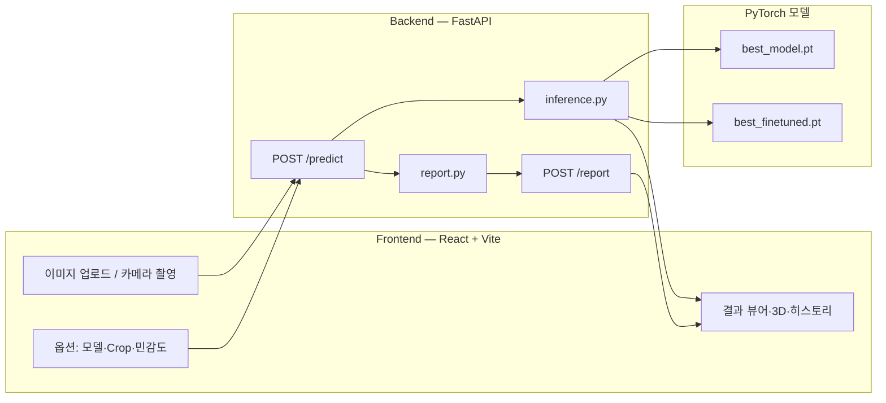

<div align="center">
  
</div>

# ArtiFix

**유물·문화재 이미지의 표면 손상을 자동으로 탐지·분류하고, 웹 UI로 시각화하는 컴퓨터 비전 시스템입니다.**

박물관·문화재 보존 현장에서 전문가가 육안으로 수행하던 손상 기록·모니터링을 딥러닝으로 보조합니다.
**복원(Restoration)이나 3D 재구성(Reconstruction)을 목표로 하지 않으며**, 손상 위치·유형·심각도를 **기록·검토**하는 데 초점을 둡니다.

---

## 목차

- [프로젝트 배경](#프로젝트-배경)
- [주요 기능](#주요-기능)
- [모델 구조](#모델-구조)
- [Ablation Study 결과](#ablation-study-결과)
- [추론 파이프라인](#추론-파이프라인)
- [시스템 아키텍처](#시스템-아키텍처)
- [기술 스택](#기술-스택)
- [프로젝트 구조](#프로젝트-구조)
- [실행 방법](#실행-방법)
- [API 명세](#api-명세)
- [프론트엔드 UI](#프론트엔드-ui)
- [환경 변수](#환경-변수)
- [가중치·데이터](#가중치데이터)
- [제한 사항](#제한-사항)

---

## 프로젝트 배경

문화재 손상은 균열, 박락, 변색 등 다양한 형태로 나타나며, 이를 체계적으로 기록하는 일은 보존 관리의 첫 단계입니다. 그러나 기존 방식은 전문가의 육안 검사와 수작업 기록에 의존해 시간과 비용이 많이 소요됩니다.

ArtiFix는 딥러닝 기반 Segmentation과 Multi-label Classification을 결합한 멀티태스크 모델로 이 과정을 자동화합니다. 이미지 한 장을 업로드하면 손상 위치(픽셀 마스크)·유형(3종 분류)·심각도를 즉시 산출하고, Grad-CAM과 3D 시각화·PDF 보고서까지 한 화면에서 제공합니다.

| 입력 | 출력 |
|------|------|
| 유물 사진 (JPG / PNG) | 손상 마스크, 오버레이, Grad-CAM, 다중 라벨 분류 신뢰도, 심각도 등급, PDF 보고서 |

<div align="center">
  
</div>

---

## 주요 기능

웹 UI는 **분석 옵션 선택 → 이미지 업로드 → 결과 확인** 순서로 동작합니다. 메인 화면에서 **「분석하기」** 를 누르면 분석을 진행할 수 있습니다.

각 옵션 옆 **(i)** 아이콘을 누르면 기능에 대한 설명이 표시됩니다.

---

### 1. 분석 옵션 선택

**「분석 옵션」** 카드에서 추론 방식을 지정합니다. **이미지를 업로드하기 전에** 옵션을 먼저 설정하는 것이 기본 흐름이며, 일부는 결과 화면에서도 조절할 수 있습니다.

#### 분석 모델 선택

| 옵션 | 가중치 | 설명 |
|------|--------|------|
| **파인튜닝 후** (기본) | `best_finetuned.pt` | 실제 유물 데이터로 파인튜닝된 모델 |
| **파인튜닝 전** | `best_model.pt` | 파인튜닝 전 베이스 모델 |

동일 이미지에 두 모델을 각각 적용해 Segmentation·분류 품질을 비교할 수 있습니다.

#### Crop 선택

| 옵션 | 설명 |
|------|------|
| **Auto Crop 사용** (기본 켜짐) | 유물 영역을 자동으로 잘라 모델 입력에 맞춥니다. 끄면 **업로드한 원본 전체**를 분석합니다. |
| **AI Background Removal** (rembg, 기본) | U²-Net 기반 배경 제거 → 아이보리 배경 합성 → 유물 bbox tight crop. 박물관 배경·그림자 제거에 유리합니다. |
| **Legacy Crop** | HSV·Otsu·엣지 기반 규칙 crop. rembg가 실패하거나 어두운 유물에 더 나을 때 선택합니다. |

crop 면적이 원본의 **35% 미만**이면 과도한 잘림으로 보고 **원본 프레임을 유지**합니다.

#### Detection Threshold 설정 

- Segmentation 마스크 생성 **임계값**입니다. **낮을수록** 더 많은 영역을 손상으로 잡고, **높을수록** 보수적으로 잡습니다.
- **업로드 전**: 분석 옵션 카드의 슬라이더로 설정 (기본 **0.25**, 서버 허용 범위 **0.05~0.60**).
- **분석 후**: **Detection Sensitivity** 슬라이더로 변경 가능하며, 슬라이더를 놓으면 **동일 이미지로 재분석**됩니다.

---

### 2. 이미지 업로드

[분석 옵션](#1-분석-옵션-선택)을 설정한 뒤, 유물 사진을 업로드하면 선택한 옵션이 그대로 적용됩니다.

| 방식 | 설명 |
|------|------|
| **파일 업로드** | JPG·PNG를 드래그 앤 드롭하거나 클릭해 선택합니다. |
| **카메라 촬영** | 업로드 영역 옆 **「카메라로 촬영」** 버튼으로 웹캠·모바일 카메라에 접근해 현장에서 바로 촬영·분석할 수 있습니다. |

- 업로드가 완료되면 **즉시 서버 추론**이 시작되며, 처리 중에는 미리보기와 로딩 스피너가 표시됩니다.
- 지원 형식: **JPG, PNG** (유물 표면이 잘 보이도록 촬영·크롭된 이미지 권장).
- **분석 히스토리**: 현재 **브라우저 탭 세션** 동안 최근 **10건**의 결과를 보관합니다. 이전 항목을 클릭해 결과만 다시 열거나, 개별·전체 삭제할 수 있습니다. (모델·crop·민감도 등 **옵션**은 LocalStorage에 저장되어 다음 방문 시에도 유지됩니다.)

---

### 3. 결과 확인

추론이 끝나면 **「분석 결과」** 섹션에서 손상 위치·유형·심각도를 확인하고, 시각화·저장·보고서까지 이어집니다.

#### ArtiFix가 다루는 손상 유형

ArtiFix는 유물·문화재 표면에서 자주 기록되는 손상을 **세 가지 유형**으로 분류합니다. Segmentation은 **손상이 있는 위치(픽셀)** 를 하나의 마스크로 찾고, Classification은 아래 유형별로 **이미지 전체에 해당 손상이 얼마나 해당하는지** confidence(0~100%)를 독립적으로 반환합니다. 한 장에 여러 유형이 동시에 나타날 수 있어 **Multi-label** 방식을 사용합니다.

| ID (API·UI) | 표시명 | 설명 | 전형적인 예 |
|-------------|--------|------|-------------|
| `crack` | Crack (균열) | 표면에 생긴 **선형·망상 균열**, 미세 crack, 깨짐선 | 도자기·석재·기와의 헤어라인, 뻗어 나가는 균열 |
| `surface_damage` | Surface Damage (표면 손상) | 재질이 **떨어지거나 깎인 박락·깨짐**, 국소적 표면 결손 | 모서리·돌출부의 chip, flaking, 표면 벗겨짐 |
| `discoloration` | Discoloration (변색) | 원래 색·질감과 다른 **얼룩·변색·황변·청변** | 수분·오염·열·노화로 인한 색 변화, 부분적 얼룩 |

- **Segmentation 마스크**: 위 세 유형을 구분하지 않고, **손상으로 판단된 픽셀 전체**를 빨간 오버레이로 표시합니다.
- **Classification confidence**: 유형마다 별도 점수가 나오므로, 예를 들어 균열 confidence는 높고 변색은 낮은 **복합 손상**도 표현할 수 있습니다.
- **Primary Damage Type**: 세 유형 중 confidence가 **가장 높은 하나**를 요약 카드에 표시합니다.

---

| 항목 | 설명 |
|------|------|
| **Damage Area** | 이미지 전체 대비 손상 픽셀 비율(%) |
| **Severity** | 면적·감지 유형 수를 종합한 `high` / `medium` / `low` / `none` |
| **Region Count** | 분할 마스크에서 분리된 손상 영역(바운딩 박스) 개수 |
| **Primary Damage Type** | `crack` · `surface_damage` · `discoloration` 중 confidence가 가장 높은 유형 |

#### 3-2. 탭별 시각화

| 탭 | 내용 |
|----|------|
| **인터랙티브 분석** | 원본 위 손상 오버레이 + 노란 bbox. 박스 클릭 시 **Region Inspector**에서 면적·비율 확인, **줌 모달**로 해당 영역 확대 |
| **Grad-CAM** | 분류 모델이 주목한 영역 히트맵 |
| **전후 비교** | 원본 vs 합성 오버레이 슬라이더 비교 |
| **전체 보기** | 원본·마스크·오버레이·Grad-CAM 4장 갤러리 |

#### 3-3. 손상 유형 · Confidence

- 이미지 **전체**에 대한 3종 손상 유형별 confidence(0~100%)를 배지·차트로 표시합니다.
- Multi-label Classification이므로 **복합 손상**(균열+변색 등)을 한 장에서 동시에 표현합니다.

#### 3-4. 보고서 · 3D · 저장

| 기능 | 설명 |
|------|------|
| **분석 보고서 (PDF)** | 손상 요약, 분석 이미지, 영역 상세를 한글 PDF로 다운로드 |
| **3D Damage Preview** | 배경 제거 유물 텍스처를 Sphere / Cylinder / **평면(Box)** 에 투영. 평면 모드는 마스크 displacement로 손상 위치를 미세 입체 강조 (복원·재구성 목적 아님) |
| **분석 이미지 저장** | 원본 · 마스크 · 오버레이 · Grad-CAM PNG 일괄 다운로드 |

#### 백엔드 산출물 (API·후처리)

결과 화면의 이미지·수치는 FastAPI `/predict` 응답을 기반으로 합니다.

- **Segmentation**: 픽셀 단위 이진 마스크 + 빨간색 오버레이 합성
- **후처리**: rembg/유물 실루엣 기반 `damage_allowed` 마스크로 **배경·유물 외부 오탐 제거**, morphology·hole 필터 적용
- **바운딩 박스**: 연결 요소별 `bboxes` (면적·좌표) — 인터랙티브 캔버스·PDF·Region Inspector에 사용

---

## 모델 구조


**4채널 입력**: Sobel Edge Map을 추가 채널로 사용해 균열처럼 강한 에지 신호를 동반하는 손상 패턴 검출을 보완합니다.

**멀티태스크 학습**: Segmentation과 Classification을 하나의 Encoder에서 공동 학습해 표현력을 높입니다.

```
Total Loss = DiceLoss + BCE(pos_weight)   [Segmentation]
           + 0.5 × BCE                    [Classification]
```

**파인튜닝 전략**: 45장의 실제 유물 이미지(Label Studio 픽셀 단위 라벨링)로 Segmentation만 추가 학습합니다. 파인튜닝 후 Classification 성능 저하(catastrophic forgetting)를 막기 위해 두 가중치를 분리 로드하고 각자의 출력만 사용합니다.

```
best_finetuned.pt  →  Segmentation 결과
best_model.pt      →  Classification 결과
```

> 모델 설계 근거, Ablation Study, 학습 로그 등 실험 전 과정은 [EXPERIMENT.md](EXPERIMENT.md)에 상세히 기록되어 있습니다.

---

## Ablation Study 결과

4단계 누적 실험으로 각 기술 요소의 기여도를 측정했습니다.

| Baseline | +Synthetic Data |
|:---:|:---:|
|  |  |
| mIoU 0.6520 | mIoU 0.6565 (+0.0045) |

| +Sobel Edge | +Multitask |
|:---:|:---:|
|  |  |
| mIoU 0.6726 (+0.0161) | mIoU **0.6764** (+0.0038) |

---

## 추론 파이프라인

```
업로드 이미지 (JPG / PNG)
        │
        ▼
  [Crop 전처리]
  rembg: U²-Net 배경 제거 → 아이보리 배경 합성 → tight bbox crop
  legacy: HSV·Otsu·엣지 기반 crop
        │
        ▼
  [4채널 텐서 생성]
  RGB 정규화 + Sobel Edge 계산 → (4, 256, 256)
        │
        ▼
  [멀티스케일 TTA 추론]
  384 / 448 / 512px 각 스케일에서 원본 + 좌우반전 + 상하반전 예측
  총 9회 sigmoid 확률 평균 → 안정적인 마스크
        │
        ▼
  [후처리]
  ├── MORPH_CLOSE (3×3 kernel): 균열 단절 완화
  ├── damage_allowed 마스크: 유물 외부 오탐 제거
  ├── hole 검출 (규칙 기반): 유물 내부 결손 보완
  └── 연결 요소 분석: 바운딩 박스 목록 생성
        │
        ▼
  [산출물]
  mask, overlay, gradcam,
  artifact_image (투명 RGBA), artifact_overlay_image (손상+유물 RGBA),
  labels, bboxes, damage_ratio, severity
```

---

## 시스템 아키텍처



---

## 기술 스택

| 영역 | 기술 |
|------|------|
| **딥러닝 프레임워크** | PyTorch, segmentation-models-pytorch |
| **데이터 증강** | Albumentations |
| **이미지 처리** | OpenCV, NumPy, Pillow |
| **배경 제거** | rembg (ONNX Runtime, U²-Net) |
| **API 서버** | FastAPI, Uvicorn |
| **PDF 생성** | ReportLab |
| **프론트엔드** | React 18, Vite 6, Tailwind CSS 3 |
| **3D 렌더링** | Three.js (OrbitControls) |
| **라우팅** | React Router v6 |
| **학습 환경** | Kaggle (T4 GPU), Python 3.10+ |

---

## 프로젝트 구조

```
ArtiFix/
├── backend/
│   ├── main.py            # FastAPI 앱, CORS, /predict · /report · /health
│   ├── inference.py       # 모델 정의, crop, 멀티스케일 TTA 추론, 후처리
│   ├── report.py          # PDF 보고서 생성 (ReportLab)
│   ├── utils.py           # 공통 유틸리티
│   ├── requirements.txt
│   ├── NanumGothic.ttf    # PDF 한글 폰트
│   └── weights/           # 학습 가중치 (Git 미포함, 로컬 배치 필요)
│       ├── best_model.pt
│       └── best_finetuned.pt
│
├── frontend/
│   ├── src/
│   │   ├── api/
│   │   │   └── api.js              # predict · report · mock API
│   │   ├── pages/
│   │   │   ├── Home.jsx            # 메인 분석 페이지
│   │   │   └── About.jsx           # 모델·스택 소개 페이지
│   │   ├── components/
│   │   │   ├── ImageUploader.jsx   # 파일 드래그·드롭 업로더
│   │   │   ├── CameraModal.jsx     # 웹캠 촬영 모달
│   │   │   ├── UploadOptions.jsx   # 모델·Crop·AutoCrop 옵션
│   │   │   ├── AnalysisControls.jsx# 민감도 슬라이더 (변경 시 재분석)
│   │   │   ├── ResultViewer.jsx    # 결과 탭 뷰 (4개 탭)
│   │   │   ├── InteractiveCanvas.jsx # bbox 오버레이·클릭 인터랙션
│   │   │   ├── RegionInspector.jsx # 선택 영역 상세 정보
│   │   │   ├── GradCamPanel.jsx    # Grad-CAM 시각화
│   │   │   ├── CompareSlider.jsx   # 전후 비교 슬라이더
│   │   │   ├── ThreeDPreviewModal.jsx # Three.js 3D 뷰어 모달
│   │   │   ├── ArtifactViewer3D.jsx   # 3D 렌더러 (Sphere·Cylinder·평면)
│   │   │   ├── ConfidenceChart.jsx # 손상 유형별 신뢰도 차트
│   │   │   ├── HistoryPanel.jsx    # 최근 분석 히스토리
│   │   │   ├── ZoomModal.jsx       # 이미지 확대 모달
│   │   │   ├── SeverityBadge.jsx   # 심각도 배지
│   │   │   ├── DamageTypeBadge.jsx # 손상 유형 배지
│   │   │   ├── ReportDownloadButton.jsx # PDF 다운로드
│   │   │   ├── InfoTooltip.jsx     # (i) 툴팁
│   │   │   ├── Header.jsx
│   │   │   └── Footer.jsx
│   │   └── utils/
│   │       ├── featureHelp.js      # 툴팁 설명 텍스트
│   │       ├── damageLabels.js     # 손상 유형 레이블·색상 매핑
│   │       ├── canvasUtils.js      # 캔버스 합성 유틸
│   │       ├── build3dTexture.js   # Three.js 텍스처 생성
│   │       ├── useLocalStorage.js  # LocalStorage 커스텀 훅
│   │       └── useScrollAnimation.js # 스크롤 애니메이션 훅
│   ├── package.json
│   └── vite.config.js
│
├── real_dataset/      # 실제 촬영 유물 이미지·마스크 (학습·평가용, 로컬)
├── docs/              # 아키텍처 다이어그램 등 문서 자료
├── image/             # 샘플 이미지
├── EXPERIMENT.md      # 실험 과정 상세 기록 (Ablation, Fine-tuning 등)
└── README.md
```

---

## 실행 방법

### 사전 요구 사항

- Python 3.10 이상
- Node.js 18 이상
- CUDA 지원 GPU (선택, 없으면 CPU 추론)
- 학습 가중치: `backend/weights/best_model.pt`, `best_finetuned.pt`

### 백엔드

```bash
cd backend

# 가상 환경 생성·활성화
python -m venv venv
venv\Scripts\activate        # Windows
# source venv/bin/activate   # macOS / Linux

pip install -r requirements.txt

# 서버 실행
uvicorn main:app --reload --port 8000
```

> rembg 첫 실행 시 `u2net.onnx`를 자동 다운로드합니다 (약 170 MB).  
> 서버 충돌 시 브라우저에서 CORS 오류처럼 보일 수 있으니 터미널 로그를 먼저 확인하세요.

- 헬스 체크: `http://localhost:8000/health`
- API 문서 (Swagger): `http://localhost:8000/docs`

### 프론트엔드

```bash
cd frontend
npm install
npm run dev
```

기본 주소: `http://localhost:5173`

백엔드 연동을 위해 `frontend/.env` (또는 `.env.local`)을 생성합니다.

```env
VITE_API_BASE_URL=http://localhost:8000
VITE_USE_MOCK_API=false
```

백엔드 없이 UI만 확인하려면 `VITE_USE_MOCK_API=true`로 설정하면 더미 응답이 반환됩니다.

### 프로덕션 빌드

```bash
cd frontend
npm run build
npm run preview   # http://localhost:4173
```

---

## API 명세

### `GET /health`

서버 상태·로드된 모델·기본 설정을 확인합니다.

```json
{
  "status": "ok",
  "models": ["base", "finetuned"],
  "default_model_variant": "finetuned",
  "crop_modes": ["rembg", "legacy"],
  "default_crop_mode": "rembg"
}
```

---

### `POST /predict`

**Content-Type:** `multipart/form-data`

#### 요청 파라미터

| 필드 | 타입 | 기본값 | 설명 |
|------|------|--------|------|
| `image` | file | 필수 | JPG / PNG |
| `seg_threshold` | float | `0.10` | Segmentation 이진화 임계값 (0.05 ~ 0.30) |
| `use_auto_crop` | string | `"true"` | 유물 자동 crop 사용 여부 |
| `model_variant` | string | `"finetuned"` | `"base"` \| `"finetuned"` |
| `crop_mode` | string | `"rembg"` | `"rembg"` \| `"legacy"` |

#### 응답 (주요 필드)

| 필드 | 타입 | 설명 |
|------|------|------|
| `original_image` | base64 PNG | crop된 RGB 이미지 |
| `artifact_image` | base64 PNG | 배경 제거 유물 RGBA |
| `artifact_overlay_image` | base64 PNG | 유물 + 손상 오버레이 RGBA |
| `mask_image` | base64 PNG | 손상 마스크 시각화 |
| `overlay_image` | base64 PNG | 손상 오버레이 합성 이미지 |
| `gradcam_image` | base64 PNG | Grad-CAM 히트맵 |
| `labels` | object | `{ crack, surface_damage, discoloration }` 신뢰도 (0~1) |
| `damage_ratio` | float | 손상 픽셀 비율 (%) |
| `severity` | string | `"high"` \| `"medium"` \| `"low"` \| `"none"` |
| `bboxes` | array | `[{ x, y, w, h, area }, ...]` |
| `model_variant` | string | 실제 사용된 모델 ID |

---

### `POST /report`

`/predict`와 동일한 form 필드를 받아 분석 후 **PDF 파일 바이너리**를 반환합니다.  
응답 헤더: `Content-Type: application/pdf`

---

## 프론트엔드 UI

### 결과 탭 구성

| 탭 | 내용 |
|----|------|
| **인터랙티브 분석** | 손상 bbox 오버레이, 클릭 시 Region Inspector에서 영역 상세 확인 |
| **Grad-CAM** | 모델 주의 히트맵 시각화 |
| **전후 비교** | 원본과 손상 오버레이를 슬라이더로 비교 |
| **전체 보기** | crop·마스크·오버레이·Grad-CAM 4장 갤러리 |

### 분석 옵션

| 옵션 | 설명 |
|------|------|
| **모델 선택** | base / finetuned 전환, 동일 이미지로 결과 비교 가능 |
| **Crop Mode** | rembg (AI) / legacy (규칙 기반) |
| **Auto Crop** | 유물 자동 crop 활성화 여부 |
| **민감도 슬라이더** | `seg_threshold` 조절, 커밋 시 자동 재분석 |

각 옵션 옆 **(i)** 아이콘을 클릭하면 기능 설명 툴팁이 표시됩니다.

---

## 환경 변수

### 프론트엔드 (`frontend/.env`)

| 변수 | 기본값 | 설명 |
|------|--------|------|
| `VITE_API_BASE_URL` | `http://localhost:8000` | 백엔드 서버 주소 |
| `VITE_USE_MOCK_API` | `false` | `true` 시 더미 응답 반환 (백엔드 불필요) |

### 백엔드

별도 `.env` 없이 `main.py` / `inference.py` 내 상수로 동작합니다.  
CUDA가 설치된 환경에서는 PyTorch가 자동으로 GPU를 감지합니다.

---

## 가중치·데이터

- **가중치 파일** (`backend/weights/*.pt`)은 GitHub 100 MB 제한으로 `.gitignore`에 포함됩니다. 저장소 클론 후 해당 경로에 직접 배치해야 합니다. 가중치가 없으면 서버 시작 시 모델 로드에 실패합니다.
- **`real_dataset/`**: 실제 촬영 유물 이미지와 Label Studio로 생성한 픽셀 마스크. 파인튜닝 및 평가용 로컬 데이터입니다.
- **학습 데이터**: Crack500 (공개 데이터셋) + 합성 데이터 (e뮤지엄 유물 이미지 기반). 학습 파이프라인은 Kaggle 환경에서 수행했습니다.

---

## 제한 사항

- 의료·법적 감정을 대체하지 않습니다. 보존 전문가의 최종 판단이 필요합니다.
- 학습 데이터(Crack500)가 아스팔트·콘크리트 도메인이므로 실제 유물과 텍스처 도메인 갭이 존재합니다.
- 조명·배경·촬영 각도에 따라 Segmentation 및 분류 성능이 달라질 수 있습니다.
- 3D Preview는 손상 위치의 시각적 강조가 목적이며 실제 형상 복원이 아닙니다.
- rembg 첫 실행 및 대용량 이미지 처리 시 응답이 지연될 수 있습니다.
