<div align="center">
  
  <br/><br/>
  <a href="https://youtu.be/jrtAe4J110I">
    
  </a>
</div>

# ArtiFix

**유물·문화재 이미지의 표면 손상을 자동으로 탐지·분류하고, 웹 UI로 시각화하는 컴퓨터 비전 시스템입니다.**

박물관·문화재 보존 현장에서 전문가가 육안으로 수행하던 손상 기록·모니터링을 딥러닝으로 보조합니다.  
**복원(Restoration)이나 3D 재구성(Reconstruction)을 목표로 하지 않으며**, 손상 위치·유형·심각도를 **기록·검토**하는 데 초점을 둡니다.

---

## 목차

| | |
|---|---|
| **소개** | [프로젝트 배경](#프로젝트-배경) · [주요 기능](#주요-기능) |
| **시작하기** | [실행 방법](#실행-방법) · [환경 변수](#환경-변수) · [가중치·데이터](#가중치데이터) |
| **시스템** | [시스템 아키텍처](#시스템-아키텍처) · [API 명세](#api-명세) · [기술 스택](#기술-스택) · [프로젝트 구조](#프로젝트-구조) |
| **모델·실험** | [실험 과정](#실험-과정) |
| **기타** | [제한 사항 및 향후 과제](#제한-사항-및-향후-과제) · [참고](#참고) |

<details>
<summary><strong>주요 기능 상세 목차</strong></summary>

- [분석 옵션 선택](#분석-옵션-선택)
- [이미지 업로드](#이미지-업로드)
- [결과 확인](#결과-확인)
  - [손상 분석 요약](#손상-분석-요약)
  - [탭별 시각화](#탭별-시각화)
  - [손상 유형 · Confidence](#손상-유형--confidence)
  - [3D Damage Preview](#3d-damage-preview)
  - [분석 보고서 (PDF)](#분석-보고서-pdf)
  - [분석 이미지 저장](#분석-이미지-저장)
  - [분석 히스토리](#분석-히스토리)
  - [모델 비교 (파인튜닝 전 vs 후)](#모델-비교-파인튜닝-전-vs-후)

</details>

<details>
<summary><strong>실험 과정 상세 목차</strong></summary>

- [실험 환경](#실험-환경)
- [데이터셋 구성](#데이터셋-구성)
- [모델 구조](#모델-구조)
- [Ablation Study](#ablation-study)
- [Ablation 결과 해석](#ablation-결과-해석)
- [Fine-tuning](#fine-tuning-실제-유물-도메인-적응)
- [추론 파이프라인](#추론-파이프라인)
- [개선 시도 및 실패 사례](#개선-시도-및-실패-사례)

</details>

---

## 프로젝트 배경

문화재 손상은 균열, 박락, 변색 등 다양한 형태로 나타나며, 이를 체계적으로 기록하는 일은 보존 관리의 첫 단계입니다. 그러나 기존 방식은 전문가의 육안 검사와 수작업 기록에 의존해 시간과 비용이 많이 소요됩니다.

ArtiFix는 딥러닝 기반 Segmentation과 Multi-label Classification을 결합한 멀티태스크 모델로 이 과정을 자동화합니다. 이미지 한 장을 업로드하면 손상 위치(픽셀 마스크)·유형(3종 분류)·심각도를 산출하고, Grad-CAM과 3D 시각화·PDF 보고서까지 제공합니다.

| 입력 | 출력 |
|------|------|
| 유물 사진 (JPG / PNG) | 손상 마스크, 오버레이, Grad-CAM, 다중 라벨 분류 신뢰도, 심각도 등급, PDF 보고서 |

<div align="center">
  
</div>

---

## 주요 기능

웹 UI는 **분석 옵션 선택 → 이미지 업로드 → 결과 확인** 순서로 동작합니다. 메인 화면에서 **「분석하기」** 를 누르면 분석 섹션으로 이동합니다. 각 옵션 옆 **(i)** 아이콘을 누르면 기능 설명이 표시됩니다.

### 분석 옵션 선택

**「분석 옵션」** 카드에서 추론 방식을 지정합니다. **이미지를 업로드하기 전에** 옵션을 먼저 설정하는 것이 기본 흐름이며, Detection Threshold는 결과 화면에서도 재조절할 수 있습니다.


#### 분석 모델 선택

| 옵션 | 가중치 | 설명 |
|------|--------|------|
| **파인튜닝 후** (기본) | `best_finetuned.pt` | 실제 유물 45장으로 도메인 적응된 모델 |
| **파인튜닝 전** | `best_model.pt` | Ablation 최종 모델 (mIoU 0.6764) |

동일 이미지에 두 모델을 각각 적용해 Segmentation 품질을 비교할 수 있습니다. [모델 비교](#모델-비교-파인튜닝-전-vs-후)에서 결과 차이 예시를 확인하세요.

#### Crop 방식 선택

| 옵션 | 설명 |
|------|------|
| **Auto Crop 사용** (기본 켜짐) | 유물 영역을 자동으로 잘라 모델 입력에 맞춥니다. 끄면 원본 전체를 분석합니다. |
| **AI Background Removal** (rembg, 기본) | U²-Net 기반 배경 제거 → 아이보리 배경 합성 → 유물 bbox tight crop. 박물관 배경·그림자 제거에 유리합니다. |
| **Legacy Crop** | HSV·Otsu·엣지 기반 규칙 crop. rembg가 실패하거나 배경이 어두운 유물에 더 나을 때 선택합니다. |

> crop 면적이 원본의 **35% 미만**이면 과도한 잘림으로 보고 원본 프레임을 유지합니다.

#### Detection Threshold 설정

Segmentation 마스크 생성 임계값입니다. **낮을수록** 더 많은 영역을 손상으로 감지하고, **높을수록** 보수적으로 감지합니다.

- **업로드 전**: 분석 옵션 카드의 슬라이더로 설정 (기본 **0.25**, 범위 **0.05~0.60**)
- **분석 후**: Detection Sensitivity 슬라이더로 재조절 가능하며, 슬라이더를 놓으면 **동일 이미지로 자동 재분석**됩니다

---

### 이미지 업로드

분석 옵션을 설정한 뒤 유물 사진을 업로드하면 선택한 옵션이 그대로 적용됩니다.


| 방식 | 설명 |
|------|------|
| **파일 업로드** | JPG·PNG를 드래그 앤 드롭하거나 클릭해 선택합니다. |
| **카메라 촬영** | 업로드 영역 옆 **「카메라로 촬영」** 버튼으로 웹캠·모바일 카메라에서 현장 촬영 후 바로 분석할 수 있습니다. |

업로드가 완료되면 즉시 서버 추론이 시작됩니다. 지원 형식: **JPG, PNG** (유물 표면이 잘 보이도록 촬영된 이미지 권장)


---

### 결과 확인

추론이 끝나면 **「분석 결과」** 섹션에서 손상 위치·유형·심각도를 확인하고, 시각화·저장·보고서까지 이어집니다.

#### ArtiFix가 다루는 손상 유형

Segmentation은 **손상 픽셀 전체**를 하나의 마스크로 찾고, Classification은 아래 3종 유형별 confidence(0~100%)를 Multi-label로 독립 반환합니다.

| ID | 표시명 | 설명 | 전형적인 예 |
|----|----|------|-------------|
| `crack` | Crack (균열) | 선형·망상 균열, 미세 crack | 도자기·석재 헤어라인, 뻗어 나가는 균열 |
| `surface_damage` | Surface Damage (표면 손상) | 박락·깨짐, 국소적 표면 결손 | 모서리 chip, flaking, 벗겨짐 |
| `discoloration` | Discoloration (변색) | 얼룩·변색·황변·청변 | 수분·오염·노화로 인한 색상 변화 |

- **Segmentation 마스크**: 유형 구분 없이 손상 픽셀 전체를 빨간 오버레이로 표시
- **Primary Damage Type**: confidence가 가장 높은 유형을 요약 카드에 표시

| Crack (균열) | Surface Damage (표면 손상) | Discoloration (변색) |
|:---:|:---:|:---:|
|  |  |  |

#### 손상 분석 요약


| 항목 | 설명 |
|------|------|
| **Damage Area** | 이미지 전체 대비 손상 픽셀 비율 (%) |
| **Severity** | 면적·감지 유형 수를 종합한 `high` / `medium` / `low` / `none` |
| **Region Count** | 분할 마스크에서 분리된 손상 영역(바운딩 박스) 개수 |
| **Primary Damage Type** | `crack` · `surface_damage` · `discoloration` 중 confidence가 가장 높은 유형 |

#### 탭별 시각화

**인터랙티브 분석**

| 인터랙티브 캔버스 | 줌 모달 |
|:---:|:---:|
|  |  |

원본 위 손상 오버레이와 노란 bbox를 표시합니다. 박스를 클릭하면 **Region Inspector**에서 면적·비율·confidence를 확인하고 **줌 모달**로 해당 영역을 확대할 수 있습니다.

**Grad-CAM**

| Grad-CAM | 원본 비교 |
|:---:|:---:|
|  |  |

분류 모델이 주목한 영역을 히트맵으로 표시합니다. 원본과 나란히 비교해 모델의 판단 근거를 시각적으로 확인할 수 있습니다.

**전후 비교**


슬라이더로 원본과 손상 오버레이를 겹쳐 비교합니다.

**전체 보기**


원본·마스크·오버레이·Grad-CAM을 갤러리 형태로 표시합니다. 각 이미지를 개별 PNG로 저장할 수 있습니다.

#### 손상 유형 · Confidence


3종 유형별 confidence(0~100%)를 배지·차트로 표시합니다. 균열과 변색이 동시에 높게 나타나는 복합 손상도 표현됩니다.

#### 3D Damage Preview


배경 제거된 유물을 **Sphere · Cylinder · 평면** 3D 오브젝트에 투영해 회전하며 확인합니다. 평면 모드에서는 손상 마스크를 displacement map으로 사용해 손상 위치를 입체적으로 강조합니다.

| 사진 모드 | 히트맵 모드 |
|:---:|:---:|
|  |  |

사진 모드는 원본 이미지 텍스처를 3D 표면에 입히고, 히트맵 모드는 손상 마스크를 열화상 컬러맵으로 변환해 손상 분포를 직관적으로 보여줍니다.

> 3D Preview는 손상 위치 시각화 기능이며, 실제 형상 복원·3D 재구성을 수행하지 않습니다.

#### 분석 보고서 (PDF)

| 분석 보고서 UI | PDF 출력 |
|:---:|:---:|
|  |  |

심각도·손상 면적·유형 confidence·분석 이미지를 **한글 PDF**로 다운로드합니다. 화면에 표시된 옵션(threshold, 모델)과 동일한 설정으로 생성됩니다.

#### 분석 히스토리


세션 내 최근 **10건**을 보관합니다. 클릭하면 해당 결과를 다시 열 수 있으며, 개별·전체 삭제가 가능합니다. 분석 옵션(threshold, 모델, crop 방식)은 LocalStorage에 저장되어 새로고침 후에도 유지됩니다.

#### 모델 비교 (파인튜닝 전 vs 후)

동일 유물에 파인튜닝 전/후 모델을 각각 분석해 Segmentation·수치를 비교합니다. Crop·Threshold는 동일 값으로 맞추세요.

| 파인튜닝 전 (`best_model.pt`) | 파인튜닝 후 (`best_finetuned.pt`) |
|:---:|:---:|
|  |  |

Crack500(아스팔트/콘크리트) 도메인으로만 학습된 파인튜닝 전 모델은 유물 표면의 균열을 일부만 감지합니다. 실제 유물 45장으로 fine-tuning한 후에는 균열의 주요 경로와 분기까지 더 완전하게 검출합니다. 동일 이미지에서 감지 면적이 약 6배 차이를 보였습니다.

> 수치 및 해석: [Fine-tuning 전후 Inference 비교](#fine-tuning-전후-inference-비교) · 학습 배경: [Fine-tuning](#fine-tuning-실제-유물-도메인-적응)

---

## 시스템 아키텍처

<div align="center">
  
</div>

**분석 흐름**: 업로드·옵션 → `POST /predict` → `main.py` → `inference.py` → 모델 추론 → JSON 응답 → 결과 뷰어

**보고서 흐름**: 결과 뷰어 → `POST /report` → `inference.py` + `report.py` → PDF 다운로드

---

## 실험 과정

### 실험 환경

| 항목 | 내용 |
|---|---|
| GPU | Kaggle T4 x2 |
| Framework | PyTorch 2.x, segmentation-models-pytorch |
| Encoder | EfficientNet-B2 (ImageNet pretrained) |
| Image Size | 256×256 |
| Batch Size | 8 |
| Epochs | 50 |
| Optimizer | AdamW (lr=3e-4, weight_decay=1e-4) |
| Scheduler | CosineAnnealingLR (T_max=NUM_EPOCHS, eta_min=1e-6) |
| Mixed Precision | FP16 (torch.amp.autocast) |
| pos_weight | 데이터 분포 기반 자동 계산 (`(1 - ratio) / ratio`) |

### 데이터셋 구성

#### 학습 데이터

| 데이터셋 | 설명 | 수량 |
|---|---|---|
| Crack500 | 아스팔트/콘크리트 균열 이미지 | train 1,896장 / val 348장 |
| 합성 데이터 (Synthetic) | 유물 이미지 기반 손상 합성 | train 960장 / val 240장 |

#### Val 라벨 분포

| 클래스 | GT Positive | 비율 |
|---|---|---|
| crack | 468개 | 79.6% |
| surface_damage | 120개 | 20.4% |
| discoloration | 120개 | 20.4% |

crack 비율이 높은 이유는 Crack500 val 348장이 전부 `[1, 0, 0]` 라벨이기 때문이다. 합성 데이터 val 240장은 다양한 라벨 조합을 포함한다.

#### 합성 데이터 파이프라인

국립중앙박물관 [e뮤지엄](https://www.emuseum.go.kr/main)에서 직접 수집한 유물 이미지 100장 기반. 픽셀 라벨링 대신 3종 손상을 코드로 합성했다.

- **crack**: 랜덤 워크 균열선 + 분기(50% 확률) + RGB 명도 감소
- **surface_damage**: 불규칙 폴리곤 박락 + GaussianBlur 경계 처리 + 명도 증가
- **discoloration**: 다중 폴리곤 누적 + 블러 + 황변/청변 랜덤 선택

**Leakage 방지**: 원본 100장을 train(80장)/val(20장)으로 먼저 분리한 뒤 각각 합성했다. 합성 샘플 단위로 분할하면 같은 유물의 서로 다른 손상 패턴이 train/val에 동시에 들어가 val 성능이 부풀 수 있기 때문이다. 12종 damage config × 장수 = train 960장 / val 240장.

### 모델 구조


#### 설계 결정

**4채널 입력 (RGB + Sobel Edge Map)**

균열은 강한 에지 신호를 동반한다. RGB만으로는 표면 텍스처와 균열을 구분하기 어려운 케이스에서 Sobel edge map을 보조 채널로 추가해 에지 정보를 명시적으로 제공했다. Ablation 결과 **+0.0161 mIoU** 향상을 확인했다.

**멀티태스크 학습 (Seg + Cls)**

Segmentation과 Classification을 동시에 학습하면 encoder가 두 태스크에 유용한 feature를 공유하게 된다. 분류 헤드가 "이 이미지에 crack이 있는가"를 학습하는 과정이 encoder 표현력을 높여 segmentation에 긍정적인 영향을 줄 수 있다는 가설 하에 설계했다. Ablation 결과 **+0.0038 mIoU** 향상을 확인했으나, 향상폭이 작아 task interference 가능성도 함께 논의한다 ([Ablation 결과 해석](#ablation-결과-해석) 참조).

**Loss 함수**

```
Total Loss = Seg Loss + λ × Cls Loss    (λ = 0.5)
Seg Loss = DiceLoss + BCEWithLogitsLoss(pos_weight)
Cls Loss = BCEWithLogitsLoss()
pos_weight = (1 - ratio) / ratio   # train foreground 비율 기반 자동 계산
```

**파인튜닝**: 실제 유물 45장으로 Segmentation만 추가 학습 → [Fine-tuning](#fine-tuning-실제-유물-도메인-적응) 참조

### Ablation Study

#### 실험 설계

각 기술 요소의 독립적인 기여도를 측정하기 위해 4단계 누적 실험을 수행했다. 기존 설정에 요소를 하나씩 추가하는 방식으로, 이전 실험의 best 설정을 유지한다. 모든 실험에서 pos_weight는 해당 실험의 train 데이터 분포로 자동 계산했다.

| 실험 | USE_SOBEL | USE_MULTITASK | USE_SYNTHETIC | IN_CHANNELS |
|---|---|---|---|---|
| Baseline | False | False | False | 3 |
| +Synthetic | False | False | True | 3 |
| +Sobel | True | False | True | 4 |
| +Multitask | True | True | True | 4 |

#### 최종 결과

| 실험 | Best mIoU | Best Dice | Best F1 | Best Epoch |
|---|---|---|---|---|
| Baseline | 0.6520 | 0.7870 | — | 29 |
| +Synthetic | 0.6565 | 0.7868 | — | 42 |
| +Sobel | 0.6726 | 0.7993 | — | 38 |
| **+Multitask** | **0.6764** | **0.8028** | **0.9808** | 46 |

| Baseline | +Synthetic Data |
|:---:|:---:|
|  |  |
| mIoU 0.6520 | mIoU 0.6565 (+0.0045) |

| +Sobel Edge | +Multitask |
|:---:|:---:|
|  |  |
| mIoU 0.6726 (+0.0161) | mIoU **0.6764** (+0.0038) |

#### 단계별 분석

| 변화 | mIoU 향상 | 비고 |
|---|---|---|
| Baseline → +Synthetic | +0.0045 (+0.7%) | 합성 데이터의 도메인 다양성 효과 |
| +Synthetic → +Sobel | +0.0161 (+2.5%) | 에지 정보가 균열 검출에 직접 기여 |
| +Sobel → +Multitask | +0.0038 (+0.6%) | 분류 태스크 공동 학습의 소폭 기여 |
| **전체** | **+0.0244 (+3.7%)** | |

<details>
<summary><strong>Ablation 상세 학습 로그</strong></summary>

**Baseline** — Crack500 1,896장 · Best mIoU **0.6520** (Ep.29) · Dice 0.7870

```
[05/50] mIoU: 0.6449 | Dice: 0.7815
[29/50] mIoU: 0.6520 | Dice: 0.7870  ← Best
[50/50] mIoU: 0.6320 | Dice: 0.7718
```

Ep.29 이후 0.63~0.64 수준에서 진동. Crack500 단독으로는 다양성이 부족해 일반화 성능이 제한적이다.

**+Synthetic** — 2,856장 · Best mIoU **0.6565** (Ep.42) · +0.0045

```
[10/50] mIoU: 0.5896 | Dice: 0.7360
[42/50] mIoU: 0.6565 | Dice: 0.7868  ← Best
[50/50] mIoU: 0.6424 | Dice: 0.7760
```

Baseline보다 수렴이 느리다. 합성 데이터 도메인 차이로 val 향상폭은 작으나 classification 라벨 다양성에 기여한다.

**+Sobel** — 4채널 · Best mIoU **0.6726** (Ep.38) · +0.0161

```
[14/50] mIoU: 0.6117 | Dice: 0.7544
[38/50] mIoU: 0.6726 | Dice: 0.7993  ← Best
[50/50] mIoU: 0.6562 | Dice: 0.7870
```

4단계 중 최대 단일 향상폭. 에지 정보가 균열 특징 추출에 직접 기여했다. Best가 38 에폭으로 늦게 나타난 것은 4채널 입력 적응 기간이 필요하기 때문으로 해석된다.

**+Multitask** — Seg+Cls 공동 학습 · Best mIoU **0.6764** (Ep.46) · Dice 0.8028 · F1 0.9808

```
[13/50] mIoU: 0.6243 | Dice: 0.7659 | F1: 0.9919
[32/50] mIoU: 0.6744 | Dice: 0.8011 | F1: 0.9784
[46/50] mIoU: 0.6764 | Dice: 0.8028 | F1: 0.9808  ← Best
[50/50] mIoU: 0.6687 | Dice: 0.7970 | F1: 0.9825
```

mIoU 향상폭이 가장 작다. cls loss 간섭 가능성이 있다. Dice 0.80을 돌파했으며, val loss가 0.5 수준으로 다른 실험 대비 낮아진 점이 특징적이다.

</details>

### Ablation 결과 해석

#### Sobel vs Multitask

+Sobel(+0.0161)이 +Multitask(+0.0038)보다 단계 기여도가 크다. 균열 검출에서 에지 정보가 classification 공동 학습보다 더 직접적인 효과를 가짐을 의미한다.

멀티태스크 향상폭이 작은 원인으로 두 가지를 고려할 수 있다.

1. **Task interference**: classification loss(λ=0.5)가 segmentation 최적화를 방해할 수 있다. λ 값 조정 실험으로 검증 가능하나 시간 제약으로 수행하지 못했다.
2. **라벨 불균형**: val의 79.6%가 crack 단일 클래스라 classification 학습이 segmentation 개선에 기여하는 효과가 제한적일 수 있다.

#### Classification 성능 (F1 0.9808)

Threshold sweep 결과 (평균 F1 최대 **0.9767** @ threshold 0.6). 클래스별 최적 threshold: crack **0.1** (F1 0.9968), surface_damage **0.7** (F1 0.9874), discoloration **0.7** (F1 0.9600).

discoloration threshold가 높은 이유는 val 샘플 수가 적고(120개), 합성 변색 패턴과 실제 변색 사이의 도메인 gap이 크기 때문이다.

#### F1 측정 버그 수정 과정

학습 로그에서 F1이 0.3333으로 고정되는 현상이 발생했다. 원인은 디버그용 `break`가 val loop에 남아 있어 첫 배치만 처리되었기 때문이다. 첫 배치가 Crack500 val 샘플(`[1,0,0]`)로만 구성되면 F1이 1/3 ≈ 0.333으로 수렴한다. `break` 제거 후 F1 0.97~0.98로 정상 출력을 확인했다. 이 버그는 모델 가중치에는 영향을 주지 않는다.

### Fine-tuning (실제 유물 도메인 적응)

#### 동기

Crack500(아스팔트/콘크리트)과 유물 표면의 텍스처 도메인이 달라 학습된 모델을 실제 유물 이미지에 적용하면 segmentation 품질이 떨어진다. 이를 완화하기 위해 실제 유물 이미지를 직접 라벨링해 fine-tuning을 수행했다.

#### 라벨링 데이터

- **도구**: Label Studio (Brush 툴, 픽셀 단위 binary mask)
- **데이터**: 45장 (손상 유물 31장 + 정상 유물 14장)
- **출처**: 국립중앙박물관 [e뮤지엄](https://www.emuseum.go.kr/main)에서 직접 수집

정상 유물 14장(negative sample)은 거친 표면·토기·산화 청동 등 false positive가 발생하기 쉬운 케이스를 빈 마스크(`mask=0`)로 포함했다. 모델이 "거친 표면 = 정상"을 학습하도록 하기 위함이다.

#### Fine-tuning 설정

```python
FINETUNE_EPOCHS = 10
FINETUNE_LR     = 1e-5    # 기존 가중치를 크게 변형하지 않도록 낮게 설정
Loss            = DiceLoss + BCEWithLogitsLoss   # cls loss 제외
```

**Classification loss 제외 이유**: 라벨링 데이터의 cls_label이 `[0, has_damage, 0]`으로 단순화되어 있어 분류 학습에 노이즈가 된다. fine-tuning 목적이 segmentation 도메인 적응이므로 seg loss만 사용했다.

#### Fine-tuning 결과

```
[FT 01/10] seg_loss: 1.1918
[FT 04/10] seg_loss: 0.9887
[FT 08/10] seg_loss: 0.9777  ← Best
🏁 Fine-tuning 완료 — Best loss: 0.9777
```

DiceLoss + BCEWithLogitsLoss 합산 기준 1.0 이하로 수렴해 정상 학습을 확인했다.

#### Catastrophic Forgetting 대응

Fine-tuning 후 classification confidence 저하가 관찰되었다. fine-tuned 모델이 유물 도메인에 특화되면서 기존에 학습한 classification 표현이 손상된 것으로 판단해, 두 모델을 분리 로드하는 방식을 채택했다.

```
seg_model = best_finetuned.pt   # Segmentation (유물 도메인 적응)
cls_model = best_model.pt       # Classification (원래 성능 유지)
```

#### Fine-tuning 전후 Inference 비교

동일한 유물 이미지(균열이 있는 석제 원형 유물) 기준 정성 비교.

| 항목 | 파인튜닝 전 | 파인튜닝 후 |
|------|------------|------------|
| **Damage Area** | 0.8% | 4.83% |
| **Region Count** | 2개 | 4개 |
| **Severity** | LOW | LOW |
| **Segmentation** | 균열 일부만 검출 | 주요 경로·분기까지 더 완전한 마스크 |

Crack500 도메인 편향으로 파인튜닝 전 모델은 유물 표면 균열을 일부만 감지했다. 파인튜닝 후에는 균열의 주요 경로와 분기 부분까지 포함해 더 완전한 마스크가 생성되었다. Severity는 동일하나 실제 감지 면적은 약 **6배** 차이를 보인다. mIoU 정량 비교는 평가 데이터 부족으로 미수행했다.

### 추론 파이프라인

재학습 없이 추론 단계에서 segmentation 품질을 높이기 위한 기법들을 적용했다.

```
업로드 이미지 (JPG / PNG)
        │
        ▼
  [Crop 전처리]
  rembg: U²-Net 배경 제거 → 아이보리 배경 합성 → tight bbox crop
  legacy: HSV·Otsu·엣지 기반 crop
        │
        ▼
  [4채널 텐서 생성]
  RGB 정규화 + Sobel Edge 계산 → (4, 256, 256)
        │
        ▼
  [멀티스케일 TTA 추론]
  384 / 448 / 512px 각 스케일에서 원본 + 좌우반전 + 상하반전 예측
  총 9회 sigmoid 확률 평균
        │
        ▼
  [후처리]
  ├── MORPH_CLOSE (3×3 kernel): 균열 단절 완화
  ├── damage_allowed 마스크: 유물 외부 오탐 제거
  ├── hole 검출 (규칙 기반): 유물 내부 결손 보완
  └── 연결 요소 분석: 바운딩 박스 목록 생성
        │
        ▼
  [산출물]
  mask, overlay, gradcam,
  artifact_image (투명 RGBA), artifact_overlay_image (손상+유물 RGBA),
  labels, bboxes, damage_ratio, severity
```

| 기법 | 내용 |
|------|------|
| **TTA** | 원본 + 좌우·상하 반전 3-way sigmoid 평균 (seg·cls 공통) |
| **Multi-scale** | 384/448/512px 예측 → 256 리사이즈 평균 (스케일당 TTA 적용, 총 9회) |
| **MORPH_CLOSE** | 3×3 kernel 1회 — 균열 단절 완화 (kernel 크게 하면 번짐 발생) |
| **Hole 검출** | 유물 실루엣 내부 배경색 픽셀을 규칙 기반으로 결손 영역으로 보완 |
| **rembg crop** | U²-Net 배경 제거 → alpha 채널로 `damage_allowed` 마스크 생성, 유물 외부 오탐 제거 |

<details>
<summary><strong>추론 파이프라인 코드 스니펫</strong></summary>

```python
# TTA
seg_prob = mean([sigmoid(pred_orig), sigmoid(pred_flip_lr), sigmoid(pred_flip_ud)])

# Multi-scale
seg_prob_final = mean([predict_at_scale(s) for s in [384, 448, 512]])

# 후처리
final_mask = np.maximum(model_mask, detect_internal_holes(cropped_rgb))
mask = cv2.morphologyEx(mask, cv2.MORPH_CLOSE, np.ones((3,3), np.uint8), iterations=1)
```

</details>

### 개선 시도 및 실패 사례

#### seamlessClone 합성 데이터 개선 (실패)

Crack500 균열 패치를 `cv2.seamlessClone`으로 유물 이미지에 합성하면 더 현실적인 균열 데이터를 만들 수 있다는 가설 하에 실험했다. 동일 설정(+Multitask, 50 에폭)에서 best mIoU **0.6216**으로, legacy 방식(0.6764) 대비 낮게 나왔다.

**원인 분석**: Crack500은 아스팔트/콘크리트 텍스처이고 유물 이미지는 도자기/금속/석재 텍스처다. seamlessClone이 픽셀 수준 경계는 자연스럽게 합성하더라도 두 도메인의 텍스처 자체가 달라 합성 데이터가 오히려 더 비자연스러웠을 가능성이 있다. 또한 seamlessClone 패치의 균열 면적이 legacy 방식보다 작아 foreground 비율이 낮아지고 pos_weight가 높아진 점도 영향을 준 것으로 추정된다.

**결론**: 롤백 후 legacy 방식 유지. "실제 패치 합성이 반드시 더 좋은 것은 아니다"는 교훈을 남겼다.

---

## 기술 스택

| 영역 | 기술 |
|------|------|
| **딥러닝 프레임워크** | PyTorch, segmentation-models-pytorch |
| **데이터 증강** | Albumentations |
| **이미지 처리** | OpenCV, NumPy, Pillow |
| **배경 제거** | rembg (ONNX Runtime, U²-Net) |
| **API 서버** | FastAPI, Uvicorn |
| **PDF 생성** | ReportLab |
| **프론트엔드** | React 18, Vite 6, Tailwind CSS 3 |
| **3D 렌더링** | Three.js (OrbitControls) |
| **라우팅** | React Router v6 |
| **학습 환경** | Kaggle (T4 GPU), Python 3.10+ |

---

## 프로젝트 구조

```
ArtiFix/
├── backend/          # FastAPI · inference · report · weights/
├── frontend/src/     # React 페이지·컴포넌트·api·utils
├── notebooks/        # multitask.ipynb · finetuning.ipynb
├── real_dataset/     # fine-tuning 라벨 데이터 (Kaggle)
├── image/            # 합성용 유물 원본 100장 (Kaggle)
├── docs/             # 아키텍처·UI 스크린샷
└── README.md
```

<details>
<summary><strong>디렉터리 상세</strong></summary>

```
backend/
├── main.py            # /predict · /report · /health
├── inference.py       # 모델, crop, TTA 추론, 후처리
├── report.py          # PDF 생성 (ReportLab)
└── weights/           # best_model.pt · best_finetuned.pt

frontend/src/
├── pages/             # Home.jsx · About.jsx
├── components/        # Uploader, ResultViewer, 3D, Grad-CAM, History 등
└── api/api.js         # predict · report · mock API
```

</details>

---

## 실행 방법

> 백엔드·프론트엔드를 로컬에서 띄우는 방법입니다. 가중치 파일은 [가중치·데이터](#가중치데이터)에서 먼저 받아두세요.

### 사전 요구 사항

- Python 3.10 이상
- Node.js 18 이상
- CUDA 지원 GPU (선택, 없으면 CPU 추론)
- 학습 가중치: `backend/weights/best_model.pt`, `best_finetuned.pt`

### 백엔드

```bash
cd backend

# 가상 환경 생성·활성화
python -m venv venv
venv\Scripts\activate        # Windows
# source venv/bin/activate   # macOS / Linux

pip install -r requirements.txt

# 서버 실행
uvicorn main:app --reload --port 8000
```

> rembg 첫 실행 시 `u2net.onnx`를 자동 다운로드합니다 (약 170 MB).  
> 서버 충돌 시 브라우저에서 CORS 오류처럼 보일 수 있으니 터미널 로그를 먼저 확인하세요.

- 헬스 체크: `http://localhost:8000/health`
- API 문서 (Swagger): `http://localhost:8000/docs`

### 프론트엔드

```bash
cd frontend
npm install
npm run dev
```

기본 주소: `http://localhost:5173`

백엔드 연동을 위해 `frontend/.env` (또는 `.env.local`)를 생성합니다.

```env
VITE_API_BASE_URL=http://localhost:8000
VITE_USE_MOCK_API=false
```

백엔드 없이 UI만 확인하려면 `VITE_USE_MOCK_API=true`로 설정하면 더미 응답이 반환됩니다.

### 프로덕션 빌드

```bash
cd frontend
npm run build
npm run preview   # http://localhost:4173
```

---

## API 명세

### `GET /health`

서버 상태·로드된 모델·기본 설정을 확인합니다.

```json
{
  "status": "ok",
  "models": ["base", "finetuned"],
  "default_model_variant": "finetuned",
  "crop_modes": ["rembg", "legacy"],
  "default_crop_mode": "rembg"
}
```

### `POST /predict`

**Content-Type:** `multipart/form-data`

#### 요청 파라미터

| 필드 | 타입 | 기본값 | 설명 |
|------|------|--------|------|
| `image` | file | 필수 | JPG / PNG |
| `seg_threshold` | float | `0.10` | Segmentation 이진화 임계값 (0.05 ~ 0.60으로 클램프) |
| `use_auto_crop` | string | `"true"` | 유물 자동 crop 사용 여부 |
| `model_variant` | string | `"finetuned"` | `"base"` \| `"finetuned"` |
| `crop_mode` | string | `"rembg"` | `"rembg"` \| `"legacy"` |

#### 응답 (주요 필드)

| 필드 | 타입 | 설명 |
|------|------|------|
| `original_image` | base64 PNG | crop된 RGB 이미지 |
| `artifact_image` | base64 PNG | 배경 제거 유물 RGBA |
| `artifact_overlay_image` | base64 PNG | 유물 + 손상 오버레이 RGBA |
| `mask_image` | base64 PNG | 손상 마스크 시각화 |
| `overlay_image` | base64 PNG | 손상 오버레이 합성 이미지 |
| `gradcam_image` | base64 PNG | Grad-CAM 히트맵 |
| `labels` | object | `{ crack, surface_damage, discoloration }` 신뢰도 (0~1) |
| `damage_ratio` | float | 손상 픽셀 비율 (%) |
| `severity` | string | `"high"` \| `"medium"` \| `"low"` \| `"none"` |
| `bboxes` | array | `[{ x, y, w, h, area }, ...]` |
| `model_variant` | string | 실제 사용된 모델 ID |

### `POST /report`

`/predict`와 동일한 form 필드를 받아 분석 후 **PDF 파일 바이너리**를 반환합니다.  
응답 헤더: `Content-Type: application/pdf`

---

## 환경 변수

### 프론트엔드 (`frontend/.env`)

| 변수 | 기본값 | 설명 |
|------|--------|------|
| `VITE_API_BASE_URL` | `http://localhost:8000` | 백엔드 서버 주소 |
| `VITE_USE_MOCK_API` | `false` | `true` 시 더미 응답 반환 (백엔드 불필요) |

### 백엔드

별도 `.env` 없이 `main.py` / `inference.py` 내 상수로 동작합니다. CUDA가 설치된 환경에서는 PyTorch가 자동으로 GPU를 감지합니다.

---

## 가중치·데이터

GitHub 용량 제한(100 MB)으로 가중치·데이터셋은 Kaggle에 업로드해두었습니다.

| 데이터셋 | Kaggle | 배치 경로 |
|----------|--------|-----------|
| **ArtiFix Weights** | [bearivh/artifix-weights](https://www.kaggle.com/datasets/bearivh/artifix-weights) | `backend/weights/` |
| **Real Dataset** | [bearivh/real-dataset](https://www.kaggle.com/datasets/bearivh/real-dataset) | `real_dataset/` |
| **ArtiFix Artifacts** | [bearivh/artifix-artifacts](https://www.kaggle.com/datasets/bearivh/artifix-artifacts) | `image/` |

| 데이터 | 출처 | 용도 |
|--------|------|------|
| Crack500 | [vangiap/crack500-dataset (Kaggle)](https://www.kaggle.com/datasets/vangiap/crack500-dataset) | 베이스 학습 (균열 segmentation) |
| 합성 데이터 | artifix-artifacts 100장 기반 코드 생성 | 베이스 학습 (3종 손상·라벨 다양화) |
| Real Dataset | bearivh/real-dataset | Fine-tuning (손상 31 + 정상 14장) |

학습 노트북: `notebooks/multitask.ipynb` (Ablation 포함) · `notebooks/finetuning.ipynb`

---

## 제한 사항 및 향후 과제

### 한계

1. **도메인 갭**: 학습의 주축인 Crack500이 아스팔트/콘크리트 도메인이라 유물 표면과 텍스처 차이가 존재한다. Crack500 val 기준 수치(mIoU 0.6764)와 실제 유물 이미지에서의 성능 사이에 괴리가 있다.

2. **합성 데이터 품질**: 코드로 생성한 손상 패턴은 실제 손상의 복잡한 형태를 완전히 재현하지 못한다. 특히 surface_damage와 일반 표면 텍스처의 경계가 모호해 false positive가 발생하는 케이스가 있다.

3. **멀티태스크 task interference**: +Multitask의 향상폭(+0.0038)이 작은 것은 classification loss가 segmentation 학습에 간섭할 수 있음을 시사한다. λ 값 조정으로 개선 가능하나 시간 제약으로 수행하지 못했다.

4. **이미지 해상도**: 계산 자원 제약으로 256×256을 사용했다. 얇은 균열은 resize 과정에서 소실될 수 있으며 Multi-scale Inference로 부분 보완했다.

5. **Fine-tuning 데이터 부족**: 45장으로는 도메인 적응에 한계가 있다. Negative sample 추가로 false positive를 일부 줄였으나 근본적 해결에는 더 많은 데이터가 필요하다.

6. **변색 검출 한계**: 단일 이미지만으로는 원래 색상을 알 수 없어 황변·산화·본래 색 불균일을 구분하기 어렵다. 합성 변색 패턴도 실제보다 단순하다. 복수 시점 이미지 비교나 제작 기록 데이터와의 결합 없이는 구조적 한계가 있다.

7. **합성 데이터 재현성**: 동일 시드에도 환경 차이로 완전히 동일한 합성 결과를 보장하기 어렵다. 생성된 데이터를 고정 저장해 재사용하는 방식이 필요하다.

8. **운영 측면**: 보존 전문가의 최종 판단을 대체하지 않으며 참고 자료로만 활용해야 한다. 조명·배경·촬영 각도에 따라 성능이 달라질 수 있다. rembg 첫 실행 및 대용량 이미지 처리 시 응답이 지연될 수 있다.

### 향후 과제

- 실제 유물 라벨링 데이터를 100장 이상으로 확대해 도메인 적응 강화
- 이미지 해상도를 384 이상으로 높여 재학습
- λ 값 변화 Ablation 추가 (LAMBDA_CLS = 0.3, 1.0) — task interference 검증
- SAM, SegFormer 등 다른 모델과의 정량 비교
- 실제 손상 패치 기반 합성 개선 (도메인 통일 후 seamlessClone 재시도)
- 합성 데이터 고정 저장 후 재사용으로 재현성 확보

---

## 참고

### 데이터·이미지 출처

| 자료 | 링크 | 활용 |
|------|------|------|
| **국립중앙박물관 e뮤지엄** | [emuseum.go.kr](https://www.emuseum.go.kr/main) | 합성·fine-tuning용 유물 사진 직접 수집 |
| **Crack500** | [vangiap/crack500-dataset (Kaggle)](https://www.kaggle.com/datasets/vangiap/crack500-dataset) | 베이스 모델 학습용 균열 segmentation 데이터 |

> e뮤지엄 소장품 이미지 사용 시 해당 사이트의 저작권 정책을 따릅니다.

### AI 도구

본 프로젝트 개발·문서 작성 과정에서 아래 AI 도구를 보조적으로 사용했습니다.

- **[Cursor](https://cursor.com)** — IDE 내 코드 작성·리팩터링·디버깅
- **[Claude](https://claude.ai)** (Anthropic) — 설계 검토, 문서 정리, README 작성 보조

---

## 라이선스

이 프로젝트는 **[MIT]** 라이선스를 따릅니다. 자세한 내용은 [LICENSE](./LICENSE) 파일을 참고하세요.
